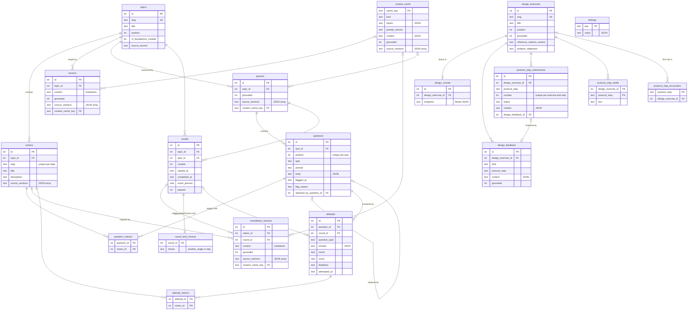

# Data Model

Local SQLite database of the app, owned by the Electron main process. Table names use the [[Ubiquitous Language]] terms. See [[SPEC#8. Data]].

- File: `system-design-from-scratch.db` in Electron's `userData` directory.
- Driver: built-in `node:sqlite` (ships with the Node embedded in Electron, no native module), wrapped by the `Database` interface in `src/main/db/driver.ts`.
- Pragmas: `journal_mode = WAL`, `foreign_keys = ON`, `busy_timeout = 5000`.
- All tables are `STRICT`. Booleans are `INTEGER` 0/1. Timestamps are ISO 8601 UTC strings with milliseconds (`2026-01-01T10:00:00.000Z`); every table has `created_at` and `updated_at`.
- Structured content (question bodies, answers, feedback, tldraw snapshots, cached content, settings values) is JSON text, checked with `json_valid`.

## Migrations

`src/main/db/migrations/` holds numbered migrations, listed in order in `migrations/index.ts`. `migrate()` (`src/main/db/migrate.ts`) applies the pending ones at startup, each in its own transaction, and records it in `schema_migrations (version, name, applied_at)`. Running it again is a no-op; a database newer than the app is refused. Never edit or reorder an applied migration: append a new one.

| Version | Name | Change |
|---|---|---|
| 1 | `initial-schema` | Every table below. |
| 2 | `notion-sources-and-question-flags` | `notions.source_sections`; `questions.flagged_at`, `flag_reason`, `replaced_by_question_id` (#7). |
| 3 | `mastery-loop` | Table `round_limit_choices`; settings `questions_per_quiz`, `claude_cli_path` (#11). |
| 4 | `interview-protocol` | `content_cache` rebuilt to accept the `protocol_step_lesson` kind (the `content_cache_key` of lessons, quizzes and remediation lessons are saved and restored around the rebuild); `design_exercises.problem_statement`; tables `protocol_step_submissions`, `protocol_step_drafts`, `protocol_step_encounters` (#14). |

## Diagram

## Tables

### Learning content

- `topics`: one [[Topic]] per row, ordered by `position` along the [[Learning Path]]. `in_foundations_module` marks [[Foundations Module]] topics; `source_section` points to the primer heading in the [[Source Corpus]] (null for foundations).
- `notions`: [[Notion]]s of a topic, `slug` unique per topic, in [[Notion Outline]] order (`id`). `source_sections` lists the [[Source Corpus]] sections the notion comes from (empty in the [[Foundations Module]]); a remediation lesson on the notion is grounded on them. The outline is generated once and is not in `content_cache`: notion ids are referenced by tags and attempts, so they must not change with a prompt version (see [[Prompts]]). Deleted with their topic.
- `lessons`: generated [[Lesson]]s of a topic (markdown). Several per topic are allowed (regeneration).
- `remediation_lessons`: [[Remediation Lesson]]s on one notion, with the [[Round]] whose failure triggered them (nullable).

Generated rows carry `grounded` and `source_sections` ([[Grounding]]) and an optional `content_cache_key` to the [[Content Cache]] entry they came from. The domain row is what the user saw; the cache entry is the reusable [[Generation]] output.

### Assessment

- `quizzes`: one [[Quiz]] on a topic.
- `questions`: [[Question]]s of a quiz, unique `position` per quiz. `type` is one of `single_choice`, `multiple_choice`, `scenario`, `free_answer`. `body` holds the type-specific payload (choices with their `correct` flag, explanation, scenario, expected points and model answer, source sections; see [[Prompts]]). Deleted with their quiz, unless they have attempts. A faulty question is flagged (`flagged_at`, `flag_reason`) and may be replaced: the replacement takes its position, the flagged row moves after the last position and points to it with `replaced_by_question_id` (history; attempts stay valid). `listQuestions` skips replaced questions, `listQuestionHistory` keeps them.
- `question_notions`: tags each question with one or more notions.
- `rounds`: one [[Round]] of the [[Mastery Loop]] on a topic, playing one quiz. `number` is unique per topic and never restarts, so the history stays ordered; the [[Round Limit]] counts rounds since the last passed round of that topic. `completed_at`, `score_percent` (0 to 100) and `passed` are all null until the round is graded, then all set; `passed` is stored because the [[Mastery Threshold]] can change later.
- `attempts`: one [[Attempt]] per answer: `attempted_at` (date), `question_id`, `question_type`, `answer` (JSON), `result` (`correct`, `partially_correct`, `incorrect`), `score` (0 to 1), optional `feedback` (free answers: the grading record as JSON, with the grading in force, the contest and the replaced gradings; see [[Quiz Engine#Free answers (#10)]]) and `round_id`. Attempts are history: a question or round with attempts cannot be deleted.
- `round_limit_choices`: the learner's choice on a failed [[Round]] that reached the [[Round Limit]]: `another_angle` or `skip` (one per round, changed when the learner comes back to a skipped topic). See [[Mastery Loop Implementation]].
- `attempt_notions`: notions of the question at the time of the attempt, copied on insert, so per-notion history survives retagging. Indexed by notion for the [[Notion Map]] and [[Dashboard]].

> [!note] Spaced repetition
> Spaced repetition is out of the MVP. Each attempt already has its date, notions, type and result, so a review schedule can be computed from `attempts` + `attempt_notions` without changing them; scheduling state, if needed, goes in a new table.

### Design practice

- `design_exercises`: [[Design Exercise]] catalogue in path order. A grounded exercise must have a `reference_solution_section` ([[Reference Solution]]).
- `design_scenes`: the [[Design Canvas]] tldraw snapshot of an exercise, one per exercise, overwritten on save.
- `design_exercises.problem_statement`: what the learner is asked to design; null falls back on the [[Reference Solution]] title.
- `design_feedback`: LLM output on a design exercise. `kind` is `step_feedback` or `hint` (both with a [[Protocol Step]]: `functional_requirements`, `non_functional_requirements`, `estimations`, `api`, `data_model`, `high_level_design`, `deep_dive`) or `final_review` (no step). `content` is `{ submissionId, promptVersion, feedback }`, `{ level, promptVersion, hint }` (the Hint log: the next level is the count + 1, at most 3 per step and exercise) or `{ submissionIds, promptVersion, review }`. `grounded` is true when the exercise has a Reference Solution. See [[Hint]] and [[Interview Protocol Implementation]].
- `protocol_step_submissions`: every submission of a Protocol Step. `number` counts per exercise and step (failed ones included). `status` is `pending` (Generation running), `reviewed` (with `design_feedback_id`, the step feedback) or `failed` (Generation failed or cancelled; pending rows left by an app quit become `failed` at startup). `content` is the text, or the [[Design Graph]] with its text description, the notes and `withPng` (the PNG itself is not stored).
- `protocol_step_drafts`: the editor text of a text step, or the notes of a canvas step, one per exercise and step, overwritten on save.
- `protocol_step_encounters`: one row per step whose [[Protocol Step Lesson]] the learner has read (once, across exercises), with the exercise where it was read.

### Generation and data

- `content_cache`: [[Content Cache]]. `cache_key` is the SHA-256 of the canonical JSON of `{ kind, inputs, promptVersion }` (object keys sorted). `kind` is `lesson`, `remediation_lesson`, `quiz` or `protocol_step_lesson` (one per step, see [[Protocol Step Lesson]]; a `notion_outline` Generation is stored in `notions` instead). Storing an entry with an existing key replaces its content.
- `settings`: key/value, values as JSON. Seeded with `mastery_threshold = 100` ([[Mastery Threshold]]), `round_limit = 3` ([[Round Limit]]), `questions_per_quiz = null` (automatic) and `claude_cli_path = null` (automatic lookup). Edited on the Settings screen ([[Mastery Loop Implementation#Settings]]).
- `schema_migrations`: applied migrations.

## Code

- `src/main/db/driver.ts`: `Database` interface and `openDatabase()`.
- `src/main/db/migrate.ts`, `src/main/db/migrations/`: migration runner and migrations.
- `src/main/db/index.ts`: `openAppDatabase()`, called from `src/main/index.ts` at startup.
- `src/main/db/types.ts`: row types.
- `src/main/db/repositories/`: typed data access, one file per glossary section (`learningContent`, `assessment`, `designPractice`, `contentCache`, `settings`). No business logic.
