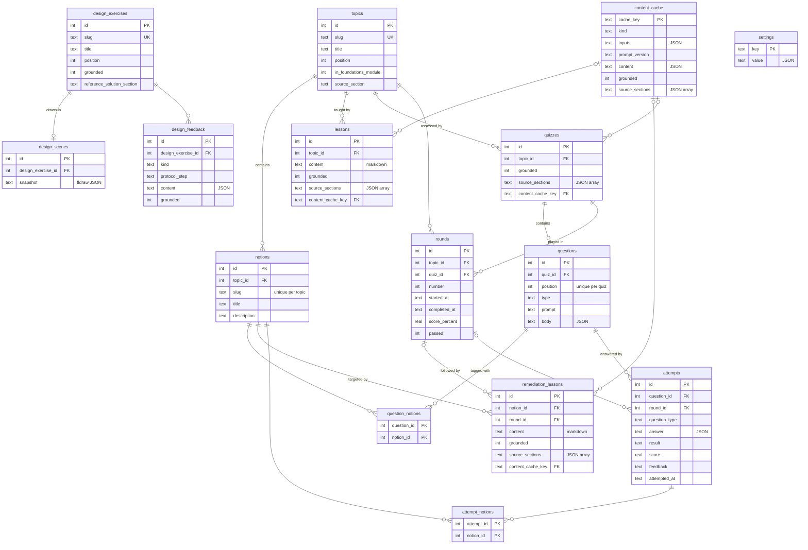

# Data Model

Local SQLite database of the app, owned by the Electron main process. Table names use the [[Ubiquitous Language]] terms. See [[SPEC#8. Data]].

- File: `system-design-from-scratch.db` in Electron's `userData` directory.
- Driver: built-in `node:sqlite` (ships with the Node embedded in Electron, no native module), wrapped by the `Database` interface in `src/main/db/driver.ts`.
- Pragmas: `journal_mode = WAL`, `foreign_keys = ON`, `busy_timeout = 5000`.
- All tables are `STRICT`. Booleans are `INTEGER` 0/1. Timestamps are ISO 8601 UTC strings with milliseconds (`2026-01-01T10:00:00.000Z`); every table has `created_at` and `updated_at`.
- Structured content (question bodies, answers, feedback, tldraw snapshots, cached content, settings values) is JSON text, checked with `json_valid`.

## Migrations

`src/main/db/migrations/` holds numbered migrations, listed in order in `migrations/index.ts`. `migrate()` (`src/main/db/migrate.ts`) applies the pending ones at startup, each in its own transaction, and records it in `schema_migrations (version, name, applied_at)`. Running it again is a no-op; a database newer than the app is refused. Never edit or reorder an applied migration: append a new one.

## Diagram

## Tables

### Learning content

- `topics`: one [[Topic]] per row, ordered by `position` along the [[Learning Path]]. `in_foundations_module` marks [[Foundations Module]] topics; `source_section` points to the primer heading in the [[Source Corpus]] (null for foundations).
- `notions`: [[Notion]]s of a topic, `slug` unique per topic. Deleted with their topic.
- `lessons`: generated [[Lesson]]s of a topic (markdown). Several per topic are allowed (regeneration).
- `remediation_lessons`: [[Remediation Lesson]]s on one notion, with the [[Round]] whose failure triggered them (nullable).

Generated rows carry `grounded` and `source_sections` ([[Grounding]]) and an optional `content_cache_key` to the [[Content Cache]] entry they came from. The domain row is what the user saw; the cache entry is the reusable [[Generation]] output.

### Assessment

- `quizzes`: one [[Quiz]] on a topic.
- `questions`: [[Question]]s of a quiz, unique `position` per quiz. `type` is one of `single_choice`, `multiple_choice`, `scenario`, `free_answer`. `body` holds the type-specific payload (choices, answer key, scenario, rubric). Deleted with their quiz, unless they have attempts.
- `question_notions`: tags each question with one or more notions.
- `rounds`: one [[Round]] of the [[Mastery Loop]] on a topic, playing one quiz. `number` is unique per topic and never restarts, so the history stays ordered; the [[Round Limit]] counts rounds since the last passed round of that topic. `completed_at`, `score_percent` (0 to 100) and `passed` are all null until the round is graded, then all set; `passed` is stored because the [[Mastery Threshold]] can change later.
- `attempts`: one [[Attempt]] per answer: `attempted_at` (date), `question_id`, `question_type`, `answer` (JSON), `result` (`correct`, `partially_correct`, `incorrect`), `score` (0 to 1), optional `feedback` (free answer grading) and `round_id`. Attempts are history: a question or round with attempts cannot be deleted.
- `attempt_notions`: notions of the question at the time of the attempt, copied on insert, so per-notion history survives retagging. Indexed by notion for the [[Notion Map]] and [[Dashboard]].

> [!note] Spaced repetition
> Spaced repetition is out of the MVP. Each attempt already has its date, notions, type and result, so a review schedule can be computed from `attempts` + `attempt_notions` without changing them; scheduling state, if needed, goes in a new table.

### Design practice

- `design_exercises`: [[Design Exercise]] catalogue in path order. A grounded exercise must have a `reference_solution_section` ([[Reference Solution]]).
- `design_scenes`: the [[Design Canvas]] tldraw snapshot of an exercise, one per exercise, overwritten on save.
- `design_feedback`: LLM output on a design exercise. `kind` is `step_feedback` or `hint` (both with a [[Protocol Step]]: `functional_requirements`, `estimations`, `api`, `data_model`, `high_level_design`, `non_functional_requirements`, `deep_dive`) or `final_review` (no step). See [[Hint]] and [[Interview Protocol]].

### Generation and data

- `content_cache`: [[Content Cache]]. `cache_key` is the SHA-256 of the canonical JSON of `{ kind, inputs, promptVersion }` (object keys sorted). `kind` is `lesson`, `remediation_lesson` or `quiz`. Storing an entry with an existing key replaces its content.
- `settings`: key/value, values as JSON. Seeded with `mastery_threshold = 100` ([[Mastery Threshold]]) and `round_limit = 3` ([[Round Limit]]).
- `schema_migrations`: applied migrations.

## Code

- `src/main/db/driver.ts`: `Database` interface and `openDatabase()`.
- `src/main/db/migrate.ts`, `src/main/db/migrations/`: migration runner and migrations.
- `src/main/db/index.ts`: `openAppDatabase()`, called from `src/main/index.ts` at startup.
- `src/main/db/types.ts`: row types.
- `src/main/db/repositories/`: typed data access, one file per glossary section (`learningContent`, `assessment`, `designPractice`, `contentCache`, `settings`). No business logic.
