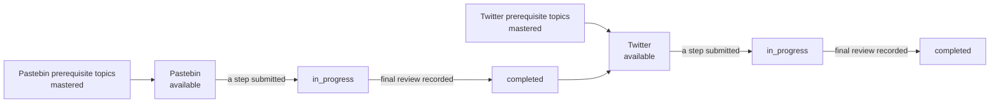

# Design Exercises

The [[Design Exercise]]s the app ships, how they sit at the end of the [[Learning Path]], and how each one is judged against its [[Reference Solution]]. The steps themselves, feedback, [[Hint]]s and the final review are in [[Interview Protocol Implementation]].

## The catalogue

Data in `src/main/protocol/designExercises.ts` (`DESIGN_EXERCISES`). The order index is the exercise index of the [[Interview Protocol]] unlock plan: it decides the active [[Protocol Step]]s.

| # | Slug | Title (UI) | Reference Solution | Active steps |
|---|---|---|---|---|
| 1 | `pastebin` | Design Pastebin.com (or Bit.ly) | primer `pastebin` | functional requirements, high-level design |
| 2 | `twitter` | Design the Twitter timeline and search | primer `twitter` | + estimations |

The six other primer solutions stay "coming soon" on the path.

- The slug is the Reference Solution id, so `design_exercises.slug`, the path key `design_exercise:<slug>` and `reference_solution_section` all match.
- **Seeding**: `seedDesignExercises` runs at startup (`src/main/index.ts`, after the topics). It inserts the missing exercises only (`position` = order index, `grounded` = true) and never updates an existing row, so a learner's exercise keeps its id, submissions and Hints. It refuses an exercise whose Reference Solution is not in the [[Source Corpus]]. No migration: the columns exist since migration 4.
- **Exercise index**: `exerciseIndexOf` returns the order index of a catalogued exercise. Dev fixtures (`dev-protocol-<n>`, from the "Design exercise (dev)" screen) are separate rows, dev only, and never rank on the path.

## Problem statements (curated)

> [!important] The one deliberate exception to "all content is generated"
> Problem statements are written by hand, in French, and stored in the catalogue. They are not generated and not copied from the primer.

Why: the primer's "Step 1: Outline use cases and constraints" **is** the reference answer of the functional requirements and estimations steps. Copying it, or letting a Generation paraphrase it, would hand the learner the answer. A statement says only:

- the product being designed and its context (what kind of service, a similar product);
- what to do first (scope, then estimate when estimations are active).

Never: a use case beyond the product's identity, an out-of-scope item, a constraint, a number. Two to four sentences, addressed with "tu", system design jargon in English (timeline).

| Exercise | Statement |
|---|---|
| Pastebin | Tu conçois un service web de partage de texte comme Pastebin.com : on y dépose du texte (du code, des logs, une note) pour le partager avec d'autres personnes grâce à un lien. Bit.ly, qui raccourcit des URL, est un problème très proche. Avant de dessiner quoi que ce soit, cadre ce que le service doit faire, et ce qu'il ne fera pas. |
| Twitter | Tu conçois le cœur d'un réseau social comme Twitter : chacun y publie des messages courts et suit d'autres personnes pour lire ce qu'elles publient. On te demande la partie timeline et la recherche. Aucun chiffre de trafic n'est donné : pose tes propres hypothèses, estime les ordres de grandeur, puis dessine. |

Guarded by `designExercises.test.ts`: 2 to 4 sentences, "tu", no digit, and no run of 4 or more consecutive words shared with the solution's use cases, constraints or Step 1 (the check is itself tested on a copied sentence).

## Prerequisites and completion

- **Topics**: `DESIGN_EXERCISE_PREREQUISITES` (`src/main/path/designExercisePrerequisites.ts`). Pastebin: performance-vs-scalability, load-balancer, database, cache. Twitter: the same plus content-delivery-network, application-layer, asynchronism (a superset, tested). The catalogue comes first in that list, in order index order.
- **Previous exercise (decision)**: an exercise also needs the previous one **completed** (`previousDesignExercise`). Exercise 2 is designed to add one step to what exercise 1 practised; opening it first would skip the two base steps and their [[Protocol Step Lesson]]s.
- **Statuses** (`buildLearningPath`): `coming_soon` when not in the catalogue; `completed` once a final review is recorded (it stays completed, even if the learner submits again); `in_progress` once any step was submitted (even if that submission failed); else `locked` while a prerequisite topic is not mastered or the previous exercise is not completed, `available` otherwise. A started exercise is never locked again.
- **Recommended step**: the first open topic first (unchanged), else the first exercise `available` or `in_progress`.
- **Lock enforcement**: outside dev builds, every Interview Protocol entry of a `locked` or `coming_soon` exercise is refused in the main process (`createExerciseLockGuard`, see [[Learning Path Implementation#Lock enforcement]]).

## Reference Solution in the prompts

The prompts no longer receive the whole solution. `referenceForSteps(solution, steps)` (`src/main/protocol/reference.ts`) keeps the parts that answer the steps being judged, under a header that names them:

| Protocol Step | Parts of the primer solution |
|---|---|
| Functional requirements | Use cases (in and out of scope) |
| Non-functional requirements, Estimations | Constraints and assumptions with the back-of-the-envelope usage, plus a note: the learner was given no number, judge the method and orders of magnitude from their own assumptions |
| API, Data model | Step 3, core components |
| High-level design | Step 2 (text only, the diagram is not bundled) and Step 3 |
| Deep dive | Step 4 (scale) and the additional talking points |

- Step feedback and Hints get the parts of the earlier active steps and of the current step; the final review gets the parts of every active step.
- So in exercise 1 no prompt holds the scale numbers or Step 4: the learner is not judged on estimations or scaling, which are not active. In exercise 2 the estimations step is judged against the twitter solution's "Calculate usage" (100 thousand reads/s, 6,000 tweets/s...).
- Every Design Feedback prompt also names the exercise's active steps and says the others are never asked for (`ExerciseBrief.activeSteps`).

## Quality review

Sample: [[samples/design-exercises|Sample Design Exercises feedback]], made by `node scripts/design-exercises-check.ts` (4 real calls, sonnet, effort low, 2026-10-09): per exercise, the step feedback of a mediocre functional requirements submission, then the first Hint (level 1).

- **French**: natural, "tu", short sentences, jargon kept in English (timeline, analytics). Minor inconsistency: "hors périmètre" and "hors-périmètre".
- **No verbatim leak**: no sentence, table or number from the reference.
- **Scope**: the exercise 2 feedback says a scale wish belongs to the estimations step ("sera chiffrée à l'étape des estimations"); exercise 1 asks for no number.
- **Hints level 1**: open questions, no component or answer. The Pastebin one points at what happens to a paste over time, close to the reference's expiration item, but as a question.
- **Leak by paraphrase, version 3**: the step feedback named reference items: Pastebin 6 of 10 curated items (accounts, editing, custom link, anonymous, expiration...), Twitter 9 of 11 (home vs user timeline, the out-of-scope list, notifications, high availability...), giving most of the reference's Step 1 away.
- **Version 4 and the leak guard** (6 more real calls, see [[Interview Protocol Implementation#Leak guard]]): the category-only prompt brought the first output to 4/10 and 2/11, 3/11; the guard's retry brought every stored feedback to 0. The feedback now says "tu ne dis pas ce qui est hors périmètre", "pense aux cas limites", "qui d'autre que l'utilisateur agit sur le système ?", and still confirms the learner's own items and flags off-scope additions (likes, retweets).
- **Still leaking**: paraphrases outside the term lists. The Pastebin v4 feedback asks whether data is "gardées toujours" and whether the service does "un travail de fond", which points at expiration and its cleanup job. The guard covers only the first step; Hints, the Twitter estimations numbers and the final review are not checked.

## Related

- [[Design Exercise]], [[Reference Solution]], [[Learning Path]], [[Interview Protocol]], [[Protocol Step]]
- [[Interview Protocol Implementation]], [[Learning Path Implementation]], [[Data Model]], [[Corpus]]
