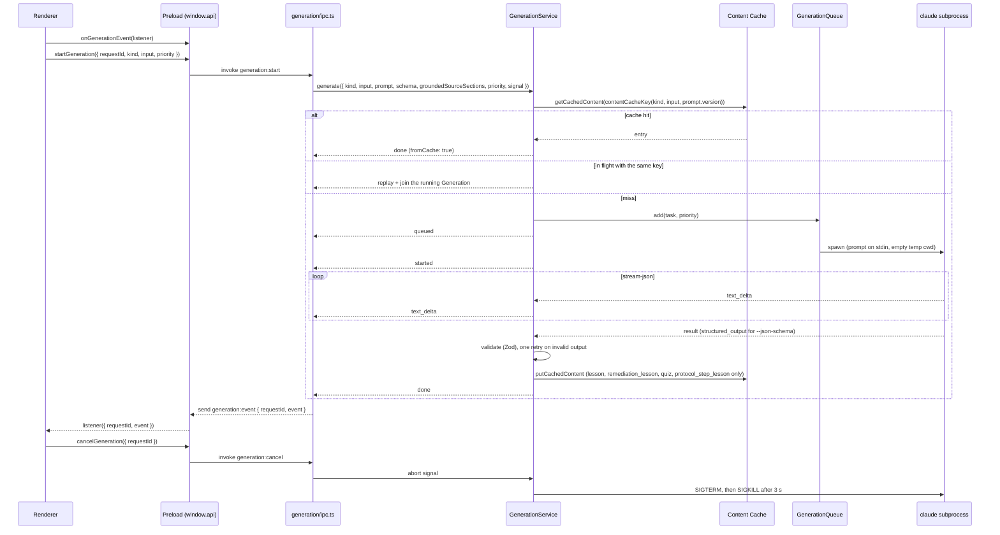

# Generation Service

The single service in the Electron main process that performs every [[Generation]]: [[Lesson|lessons]], [[Remediation Lesson|remediation lessons]], [[Quiz|quizzes]], free-answer grading and [[Design Feedback]]. It drives the Claude Code CLI as a subprocess, streams the output to the renderer over IPC, validates structured output, and reads and writes the [[Content Cache]]. Code: `src/main/generation/`. How the CLI is invoked comes from the [[cli-latency|CLI latency spike]].

> [!note] Prompts
> The content prompts and output schemas (Notion Outline, lesson, quiz, remediation lesson) are in `src/main/generation/prompts/`, with the pipelines that load and persist their data in `src/main/generation/pipelines.ts`: see [[Prompts]]. Free-answer grading (#10) is in `src/main/generation/prompts/freeAnswerGrading.ts`, run by the [[Quiz Engine]]. `src/main/generation/placeholderPrompts.ts` only serves the generic `generation:start` IPC round trip of the dev panel, (design feedback has its own prompts since #14, see [[Interview Protocol Implementation]]).

## Flow



## API

`GenerationService.generate({ kind, input, prompt, schema?, groundedSourceSections?, priority?, signal?, timeoutMs? })` returns `{ events, result }`:

- `events`: async iterable of `GenerationEvent` (`queued`, `started`, `text_delta`, `retry`, then `done` or `error`). Types in `src/shared/generation.ts`, shared with the renderer.
- `result`: promise of the `GenerationOutput` (`content`, `fromCache`, `grounded`, `sourceSections`, `cacheKey`, `usage`), rejected with a `GenerationError`.
- `kind`: `lesson`, `remediation_lesson`, `quiz`, `notion_outline`, `free_answer_grading`, `design_feedback` (step feedback, [[Hint]]s, final review), `protocol_step_lesson` ([[Protocol Step Lesson]]).
- `images`: PNG images sent before the prompt text (the [[Design Export]] capture of a graph step). The CLI then gets `--input-format stream-json` and one stream-json user message on stdin (`buildCliInput`); see [[Interview Protocol Implementation#Image input through the Claude Code CLI]]. Not part of the cache key: only for uncached kinds.
- `prompt`: `{ version, system, user }`. `version` is part of the cache key: bump it with every prompt change.
- `schema`: a Zod schema. When set, the Generation is structured: the schema is converted to JSON schema (draft-07, without `$schema`, which the CLI rejects) and passed as `--json-schema`; the CLI returns `structured_output`, which is validated again with Zod. Structured Generations send no `text_delta` (the CLI streams partial JSON fragments, not worth rendering).
- `groundedSourceSections`: [[Source Corpus]] section ids such as `cache/when-to-update-the-cache`. Non-empty means [[Grounding|grounded]].

`pregenerate(request)` starts a [[Pre-generation]] (priority `background`) and returns `{ cancel, result }`. `cancelPregenerations()` cancels every Generation that only background requests wait for. `dispose()` cancels everything; it runs on app quit.

## Content Cache

- Key: `contentCacheKey(kind, input, prompt.version)` from `src/main/db/repositories/contentCache.ts`.
- Only `lesson`, `remediation_lesson`, `quiz` and `protocol_step_lesson` are cached (the kinds of the `content_cache` table, see [[Data Model]]). Grading and design feedback depend on the learner's answer and are generated every time.
- A hit returns at once with `fromCache: true` and `usage: null`. A cached structured entry that no longer matches its schema is regenerated.
- Successful results are stored with `grounded` and `source_sections`. Failed and cancelled runs are never stored.
- Identical in-flight requests (same key) share one CLI call; late joiners get the events so far replayed. A request that cancels leaves the shared call running for the others; the call is killed when the last one leaves.

## Queue

- At most `concurrency` CLI processes at once (default 2, option `queue.concurrency`).
- Waiting foreground requests always start before waiting background ones. A running Generation is never interrupted (it is already paid for); instead background work may use at most `concurrency - 1` slots (option `queue.maxBackground`), so a foreground request normally starts at once.
- A foreground request that joins a queued pre-generation promotes it to foreground.

## CLI invocation

```bash
claude -p --output-format stream-json --include-partial-messages --verbose \
  --no-session-persistence --tools "" --setting-sources "" --strict-mcp-config \
  --disable-slash-commands --safe-mode \
  --model sonnet --effort low --system-prompt "<system>" [--json-schema '<schema>']
# prompt on stdin, cwd = fresh empty temp dir (removed after exit)
```

| Flag | Why |
|---|---|
| `-p --output-format stream-json --include-partial-messages` | Non-interactive, one NDJSON event per line, text deltas as they are generated. |
| `--verbose` | Required by the CLI for `stream-json` in print mode. |
| `--no-session-persistence --tools "" --setting-sources "" --strict-mcp-config --disable-slash-commands --safe-mode` | Isolation: without them the user's hooks, plugins, MCP servers and skills add 20-45k tokens and 1 s of startup to each call, and can change the output style. Kept together. |
| `--model sonnet --effort low` | Fastest measured setup for lessons and quizzes (first token about 1.6 s). Configurable (`cli.model`, `cli.effort`, `null` omits `--effort`). |
| `--system-prompt` | Replaces the CLI's default system prompt. |
| `--json-schema` | Structured Generations: the CLI enforces the shape and returns `structured_output`. |
| Prompt on stdin | No argv size limit for large [[Excerpt|excerpts]]. With images: `--input-format stream-json` and one user message with image blocks then the text. |
| Empty temp cwd | No `CLAUDE.md` or project settings discovered. |

The `result` event is the completion: the service does not wait for the process exit (about 0.45 s later); a process that lingers 5 s after its result is killed. Unknown events and non-JSON lines are ignored.

### Locating the binary

A GUI-launched Electron app gets a minimal PATH (`/usr/bin:/bin:...`), so `spawn('claude')` fails even when it works in a terminal. The path is resolved once (again after a failure), in this order:

1. The configured path (`cli.path`; in the app the Claude Code CLI path of the Settings screen, setting `claude_cli_path`, else the `CLAUDE_CLI_PATH` environment variable). If set and missing, the error says so; no silent fallback. Changing the setting calls `resetCliPath()`, so it applies without restart; the Settings screen's "Test" button resolves the path the same way and runs `claude --version`.
2. Each directory of `PATH`.
3. Common install locations: `~/.claude/local`, `~/.local/bin`, `/opt/homebrew/bin`, `/usr/local/bin`, `~/.npm-global/bin`, `$npm_config_prefix/bin`.
4. `$SHELL -lc 'command -v claude'` (login shell, 5 s timeout). Only an absolute, executable path is accepted (an alias prints its definition).

## Errors

Every failure ends the stream with `{ type: 'error', error: { code, message } }`. The message tells the learner what to do; for CLI failures it ends with the CLI's own text.

| Code | When | What the learner should do |
|---|---|---|
| `cli_not_found` | Binary not resolved, or `spawn` fails with `ENOENT`/`EACCES` | Install Claude Code or fix its path in the settings |
| `not_logged_in` | Failed run whose message mentions login, an invalid API key or 401 | Run `claude` in a terminal and log in |
| `quota_or_rate_limit` | Failed run mentioning a usage limit, rate limit, quota, 429 or overload | Wait for the limit to reset |
| `bad_model` | Failed run with `[claude-code:unrecognized_model]` or "issue with the selected model" | Pick another model |
| `timeout` | No result within `timeoutMs` (default 120 s) | Retry |
| `invalid_output` | Output still invalid after the automatic retry (empty text, no JSON, schema mismatch) | Retry |
| `cancelled` | The request's signal aborted, its window closed, or the app quit | None |
| `topic_locked` | Not from the CLI: a Round or Remediation Lesson refused before any Generation because the topic is locked on the [[Learning Path]] (packaged app only, see [[Learning Path Implementation#Lock enforcement]]) | Master the previous step |
| `unknown` | Anything else (non-zero exit, no `result` event) | Retry |

A run fails when the `result` event has `is_error: true`, even if `subtype` is `"success"` (observed in the spike), or when the process exits without a successful result. Only the `bad_model` shape was observed for real; the login and quota patterns are best-effort.

On invalid output the service retries once, appending the validation error to the prompt, and sends a `retry` event (the renderer drops the text streamed so far).

## Cancellation

The request's `AbortSignal` (or `generation:cancel` over IPC) sends `SIGTERM` to the CLI, then `SIGKILL` after 3 s if it is still alive. The run settles only once the process has exited, so no process is left behind. The same happens on timeout and on app quit (`dispose()`).

## IPC

Declared in `src/shared/ipc.ts`:

- `window.api.startGeneration({ requestId, kind, input, priority? })`: the renderer picks `requestId` (`crypto.randomUUID()`) so it can match events that arrive before the call returns. Validated with Zod in the main process.
- `window.api.cancelGeneration({ requestId })`.
- `window.api.onGenerationEvent(listener)`: event channel `generation:event` (main to renderer), payload `{ requestId, event }`; returns an unsubscribe function.

`src/main/generation/ipc.ts` builds the prompt and schema for the kind (placeholders: the renderer sends free-form input; typed channels for the real pipelines come with #8, #9 and #11), runs the Generation and forwards its events. In development builds, the home screen shows a small "Generation (dev only)" panel to check the round trip.

## Tests

- Unit tests run against a fake `claude` (`src/main/generation/testing/fakeClaude.mts`, an executable Node script in a temp dir emitting stream-json shaped like the real CLI), or an injected runner for queue and deduplication tests. No quota is used.
- `src/main/generation/cli.integration.test.ts` makes 2 real calls (streamed text, schema output) and is skipped unless `RUN_CLI_INTEGRATION=1`.
- `scripts/prompt-quality-check.ts` runs the real content pipeline for one topic (at most 5 calls), see [[Prompts#How to iterate]].
