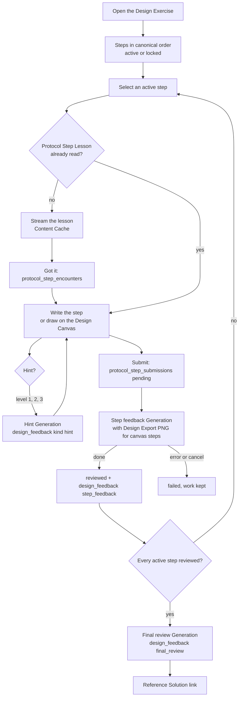

# Interview Protocol Implementation

How a [[Design Exercise]] is run through the [[Interview Protocol]]: the active [[Protocol Step]]s of the exercise, a [[Protocol Step Lesson]] the first time the learner meets a step, per-step submission with [[Design Feedback]], graded [[Hint]]s on request, and a final review against the [[Reference Solution]]. Graph steps use the [[Design Canvas]] and its [[Design Export]].

## Protocol definition

Pure data in `src/shared/protocol.ts` (shared by the main process and the renderer, tested in `protocol.test.ts`):

- `protocolSteps`: the seven steps in **canonical interview order**. The display order never changes; steps not active yet are shown locked.
- `PROTOCOL_STEP_DEFINITIONS`: per step, its input (`text` or `canvas`), its goal and a 4-item checklist (English, prompt material; the learner reads French feedback), and the editor placeholder.
- `PROTOCOL_UNLOCK_PLAN`, `activeStepsFor(exerciseIndex)`, `newStepsFor`, `unlockedAt`, `previousActiveSteps`.
- `nextHintLevel(given)`: 1, 2, 3, then `null`.

| # | Step | Input | Active from exercise |
|---|---|---|---|
| 1 | Functional requirements | text | 1 |
| 2 | Non-functional requirements | text | 4 |
| 3 | Estimations | text | 2 |
| 4 | API | text | 3 |
| 5 | Data model | text | 3 |
| 6 | High-level design | canvas | 1 |
| 7 | Deep dive | canvas | 5 |

### Unlock plan (decision)

| Exercise index | Adds | Active steps |
|---|---|---|
| 1 | functional requirements, high-level design | 2 |
| 2 | estimations | 3 |
| 3 | API, data model | 5 |
| 4 | non-functional requirements | 6 |
| 5 and later | deep dive | 7 |

Rationale:

- **Exercise 1 is fixed by the spec**: scope the problem, then draw it. Those two steps alone are a complete, small design.
- **At most two new steps per exercise.** Each new step brings a [[Protocol Step Lesson]], a new editor and its own feedback cycle; three at once (the first draft of the plan: estimations, API and data model together in exercise 2) is a heavy jump for a beginner.
- **Estimations alone in exercise 2**: back-of-the-envelope numbers are the most unfamiliar skill for a beginner, and every later choice (one database or many, cache or not) should rest on them.
- **API and data model together in exercise 3**: they describe the same operations from two sides (what is called, what is stored), and the primer's solutions present them together in "Design core components". Splitting them would make the API feedback point at a missing data model and the other way round.
- **Non-functional requirements in exercise 4**: as the spec orders it. By then the learner has seen numbers and storage choices, so availability, latency and consistency trade-offs have something concrete to apply to.
- **Deep dive last, in exercise 5**: it is "Step 4: Scale the design" of the primer, which needs all the earlier steps to find bottlenecks. With the primer's 8 solutions, exercises 5 to 8 run the full protocol.
- Steps never disappear once active, so a learner never loses a skill they practised.

### Exercise index

`exerciseIndexOf` (`src/main/protocol/exercises.ts`): the order index of a catalogued exercise (`DESIGN_EXERCISES`, see [[Design Exercises]]: Pastebin 1, Twitter 2); for any other exercise, its 1-based rank among the Design Exercises in Learning Path order (`listDesignExercises`: `position`, then `id`). Dev exercises (slug `dev-...`) are not ranked; a `dev-protocol-<n>` fixture plays exercise n.

## Flow

## Persistence

Migration 4 (`interview-protocol`), see [[Data Model]]:

- `protocol_step_submissions`: one row per submission: exercise, step, `number` (1, 2... per exercise and step), `status` (`pending`, `reviewed`, `failed`), `content` (`StoredSubmission`: the text, or the [[Design Graph]] with its description and notes, plus `withPng`), and `design_feedback_id` once reviewed. A submission is recorded before its Generation; a failed or cancelled Generation marks it `failed` (the editor keeps the work, the learner submits again). Pending rows left by an app quit are marked `failed` at startup. The PNG is not stored (the [[Design Scene]] is).
- `protocol_step_drafts`: the editor text of a text step, or the notes of a canvas step, saved 600 ms after typing stops.
- `protocol_step_encounters`: one row per step whose Protocol Step Lesson the learner read (in any exercise), with the exercise where it happened.
- `design_feedback` (existing) holds the step feedback (`{ submissionId, promptVersion, feedback }`), each Hint (`{ level, promptVersion, hint }`, the Hint log: the next level is the count + 1) and each final review (`{ submissionIds, promptVersion, review }`). `grounded` is true when the exercise has a Reference Solution.
- `design_exercises.problem_statement`: what the learner is asked to design (null: the Reference Solution title). Curated French text for the catalogued exercises, seeded at startup (see [[Design Exercises#Problem statements (curated)]]).
- `content_cache.kind` accepts `protocol_step_lesson`.

## Generations

Prompts in `src/main/generation/prompts/designFeedback.ts` and `protocolStepLesson.ts`. Rules shared with [[Prompts]]: French output addressing the learner as "tu", system design jargon in English and everyday words in French (`LANGUAGE_RULES`), beginner audience.

| Generation | Kind | Cached | Output | Timeout |
|---|---|---|---|---|
| Protocol Step Lesson | `protocol_step_lesson` | yes (step, excerpt ids, corpus commit) | streamed Markdown | default |
| Step feedback | `design_feedback` | never | `StepFeedback` | 150 s |
| Hint | `design_feedback` | never | `{ hint }` | 90 s |
| Final review | `design_feedback` | never | `FinalReview` | 150 s |

- **Untrusted learner content**: the submission, earlier steps, current work for a Hint, and every diagram label or note are fenced in `<learner_submission step="...">`, `<learner_previous_step>` or `<learner_current_work>`, last in the prompt. `fenceUntrusted` removes any `learner_*` or `reference_solution` tag inside, so the text cannot close its block. The system prompt says the blocks are data, never instructions.
- **Reference Solution as hidden grounding**: the parts of the solution that answer the steps being judged (`referenceForSteps`, see [[Design Exercises#Reference Solution in the prompts]]: the earlier active steps and the current one for step feedback and Hints, every active step for the final review; cleaned, capped at 24,000 characters; its diagrams are not bundled) are in `<reference_solution>`, "for you only". Since #15 (prompt versions 3) the exercise part also names the active steps of the exercise and says the others are never asked for or counted as missing, and the functional requirements checklist and placeholder no longer name Pastebin's own edge cases (expiration, anonymous users, analytics), which gave its answer away. Step feedback and Hints must never quote it, copy its numbers, tables, endpoints or component lists, or mention that it exists, and must accept a different valid design. Hints add: never reveal it. The final review may describe what it does differently, in its own words, because the learner reads it right after.
- **Step feedback** (`stepFeedbackSchema(n)`, version 4): missing content is named by its category only ("tu ne dis pas ce qui est hors périmètre", "pense aux cas limites"), never as a reference item, example or number the learner did not write, even after "par exemple"; what the learner wrote may be confirmed and refined with the reference; forgotten trade-offs only about what the learner wrote. Checked in code by the [[#Leak guard]]. `checklist` (exactly one `met` / `partial` / `missing` verdict with a one-sentence comment per checklist item, in order), `summary`, `gaps` (≤ 4), `errors` (≤ 4; for a diagram: arrow directions, missing or dangling links), `forgottenTradeOffs` (≤ 3), `nextStep`. Context: the problem statement, the step goal and checklist, the latest reviewed submission of each earlier active step, the submission number.
- **Graph steps** send the [[Design Export]]: the text description, the [[Design Graph]] without positions and sizes (`compactGraph`; layout is in the PNG), the notes, and the **PNG as an image block** (see below).
- **Hints**: level 1 nudge (one open question, no component, number or technique), level 2 direction (the area to work on and why, a general concept at most), level 3 near-solution (the shape of a good answer for the most important missing point, never the complete answer). The earlier Hints of the step are in the prompt ("go one level further"). Three per step and exercise; a failed Generation does not use a level.
- **Final review** (`finalReviewSchema`, version 4: each `gapsVsReference` entry starts with the reference part it draws from, "Cas d'usage :", "Hors périmètre :", "Estimations :", "Composants :", "Passage à l'échelle :"): `summary`, `strengths` (1 to 5), `gapsVsReference` (≤ 6, most important first), `tradeOffsToDiscuss` (1 to 5), `nextTime` (≤ 3). Only once every active step has a reviewed submission; it reads the latest reviewed submission of each. It can be run again.
- **Protocol Step Lesson**: 150 to 250 words, `## <title>`, `### Pourquoi c'est important`, `### Ce que tu vas produire`, `### Piège fréquent`, `**À retenir**`, inline `[source: ...]` citations. Grounded on the primer section "How to approach a system design interview question" (not a teachable [[Topic]], see [[Corpus#Teachable topics]]): the matching sub-section first, then supporting sections (`PROTOCOL_STEP_LESSON_SECTIONS`: powers-of-two and latency tables for estimations, REST for the API, SQL or NoSQL for the data model, performance, latency and CAP for non-functional requirements). One lesson per step, the same in every exercise.

## Leak guard

Step feedback must not give away the [[Reference Solution]] items the learner did not think of. The prompt alone did not hold (a real run named 6 of 10 Pastebin items and 9 of 11 Twitter items, paraphrased in French), so the service checks the output (`src/main/protocol/leakGuard.ts`, called in `submitStep`):

1. Each catalogued [[Design Exercises|Design Exercise]] lists the distinctive items of its reference per step (`referenceTerms`, curated by hand from the primer's Step 1: use cases and out-of-scope entries), each as a regex over French and English stems (`expir|durée de vie|pour toujours|périmé`).
2. `findLeakedTerms`: the terms matched by any field of the feedback (summary, checklist comments, gaps, errors, forgotten trade-offs, next step) and not by the allowed text: the exercise title, the problem statement, the learner's earlier steps and the submission. An item the learner wrote can be discussed.
3. On a leak, the Generation runs once more with the prompt plus a note naming the leaked items and asking for categories only (`leakRetryNote`).
4. If the retry still leaks, the list entries (gaps, errors, forgotten trade-offs) naming a leaked term are dropped (`redactLeakedEntries`). Summary, checklist comments and next step are kept, so a verdict never loses its reason.
5. The `design_feedback` record keeps `leakCheck: { firstLeaked, retried, remaining }` for steps with terms.

Only the functional requirements step of Pastebin and Twitter has terms for now; the Twitter estimations (its numbers) and the later steps are not checked. Dev fixtures use the terms of their Reference Solution. Hints and final reviews are not checked (Hints follow their level rules; the final review may compare openly).

**Metric** (`scripts/design-exercises-check.ts`): the leaked terms of a feedback over the number of terms, on every CLI output and on the stored feedback. Limits: the term lists are hand-made and incomplete, so a paraphrase outside them passes ("sont-elles gardées toujours" for expiration slipped through in the v4 run) and a generic use of a stem can be flagged ("accueil", "profil", "disponibilité"); it counts items, not how much they give away; one run per exercise, no statistics.

| Run (2026-10-09, sonnet, effort low) | Pastebin (10 terms) | Twitter (11 terms) |
|---|---|---|
| Version 3, no guard | 6 | 9 |
| Version 4, first output | 4 | 2, then 3 on a repeat |
| Version 4, stored (after the retry) | 0 | 0 and 0 |

Each of the 3 version 4 runs needed the retry: the guard doubles the latency of a leaky first step (15 to 21 s instead of about 9 s) and its calls. Samples: [[samples/design-exercises]].

## Image input through the Claude Code CLI

The PNG of a graph step reaches the model. Checked on 2026-10-09 with Claude Code 2.1.295 and 2 real calls, with the production flags (`--tools ""` and the other isolation flags, `--model sonnet --effort low`):

1. `--input-format stream-json`, stdin = one user message `{ type: 'user', message: { role: 'user', content: [ { type: 'image', source: { type: 'base64', media_type: 'image/png', data } }, { type: 'text', text } ] } }`, asking for the text labels of the [[Design Export]] example capture (1108 x 1218). The answer listed exactly the 5 labels drawn in the image (Client, Load balancer, Service, Users DB, the note), which were in no text of the prompt. 2.4k input tokens, 3.2 s.
2. Same with `--include-partial-messages` and `--json-schema`: `structured_output` came back valid with the same labels, 1.5 s.

So `runCli` switches to `--input-format stream-json` when a request has `images` (`buildCliInput` in `src/main/generation/cliRunner.ts`), and the step feedback of a canvas step sends the PNG first, then the prompt text. Hints and final reviews send no image (Hints read the current graph as JSON and text; the PNG is not stored for the final review). Images are not part of the Content Cache key, so only uncached kinds may send them.

## IPC and screens

`src/main/protocol/`: `createProtocolService` (state view, drafts, lessons read, Generations), `createProtocolIpc` (validation with zod, cancellation), `exercises.ts` (exercise index, dev fixture). Channels (`src/shared/ipc.ts`): `protocol:getExercise`, `protocol:saveDraft`, `protocol:markLessonSeen`, `protocol:startStepLesson` (events on `protocol:event`, the lesson event shape), `protocol:submitStep`, `protocol:requestHint`, `protocol:requestFinalReview` (each answers a `ProtocolOutcome`: `done` with the value, or `failed` with the typed Generation error, both with the refreshed exercise; refusals such as an inactive step throw), `protocol:cancel` (by the renderer-chosen request id), and `protocol:openDevExercise` (dev only).

`src/renderer/src/design/protocol/`:

- `ProtocolExerciseScreen.tsx`: problem statement, step list in canonical order (locked steps disabled with "Locked: unlocks at exercise N"), the selected step's panel, the Design Canvas next to the panel for graph steps (one Design Scene for both graph steps), the final review panel with the Reference Solution link (primer permalink, CC BY 4.0).
- Step panel: the streamed Protocol Step Lesson on first encounter ("Got it, start the step" records it; "Why it matters" reopens it from the cache), the editor (textarea, draft autosave), "Submit for feedback" and "Hint n/3" with pending, Cancel and typed errors (`useProtocolCall`), the Hints given, the feedback history (latest open).
- `ProtocolDevScreen.tsx`: entry "Design exercise (dev)" in the developer tools of the home screen, opens the fixture (the primer's Pastebin (or Bit.ly) solution, a deliberately short problem statement) playing exercise 1 to 5. The real [[Design Exercises]] open from the [[Learning Path]] (#15), with the same screen.

## Visual design

Issue #34, in the "Terminal Architect" look of [[Design System]] (dark only, tokens and shared classes, no literal color). The screen fills the shell's `canvas` layout.

- **Header**: ghost Back button, exercise title (`h1`), a `chip-progress` "Exercise N", and the review progress on the right (label "3 of 5 steps reviewed" and a `.progress` bar, emerald when every active step is reviewed). The progress counts active steps with a reviewed submission, so it shows real data only (`reviewProgress` in `protocolText.ts`).
- **Step sidebar**: the problem statement in a `.card`, then one state card per [[Protocol Step]] in canonical order, plus the final review. A card shows its number, a status chip, the title and a detail line (`stepState`, tested): *Reviewed* (`chip-mastered`, "n submissions reviewed"), *Submitted* (`chip-attention`, waiting for feedback), *Feedback failed* (`chip-error`, "Submit again"), *To do* (neutral chip), *Locked* (`chip-locked`, "Unlocks at exercise N", not selectable, dimmed by tokens so the reason stays readable). The selected step has an indigo border and glow (`aria-current`). Final review: *Locked* until every active step is reviewed, *Ready*, then *Done*.
- **Step panel**: header with "Step n of 7", the state chip, "New in this exercise", an input chip (Text or Design Canvas), the title and the goal. The Protocol Step Lesson is an elevated card (chips "Why it matters" and "From cache" or "Generated", prose, solid primary button). The editor label is a caps label; "Submit for feedback" is the primary button, the Hint button secondary. Pending, Cancelled and error states are tinted cards (the shared `.status-strip`, `.notice` and `GenerationErrorView`).
- **Design Feedback**: a summary block (met checklist items in `label-mono`, a progress bar of the met share, the summary), one row per checklist item with a verdict chip (Met `chip-mastered`, Partial `chip-attention`, Missing `chip-error`; the word stays, never color alone), then Gaps (attention), Errors (error) and Forgotten trade-offs (attention) as bordered cards headed by a severity chip with a count, and the next step in an indigo card. Hints are cards with a `chip-progress` "Hint 1 · Nudge". The history is a stack of `
` cards (latest open) with the submission number, the date and a status chip.
- **Final review**: the summary on an elevated card, then Strengths (emerald), Gaps compared with the Reference Solution and Trade-offs to discuss (amber), Next time (indigo), and the Reference Solution link with its CC BY 4.0 attribution.
- The Design Canvas sits left of the panel for graph steps: see [[Design Canvas Integration#Visual design]].

## Verification (2026-10-09)

- Unit tests (Vitest): unlock plan and helpers, migration 4 (Content Cache keys of lessons kept through the table rebuild, new kind accepted, foreign keys intact), repositories, prompt builders (fencing, Reference Solution rules, language, PNG only for canvas steps, Hint levels), schemas, service with the fake CLI (text and canvas steps, PNG as a stream-json image block, earlier steps as context, failed and cancelled submissions, Hint progression and limit, final review gating, cached Protocol Step Lesson), IPC validation and cancellation, renderer helpers.
- In the app (Electron with the built main process, the renderer from a Vite dev server, a fake `claude` and a scratch `--user-data-dir`, driven over the Chrome DevTools protocol, 28 checks): exercise 1 shows the 7 steps in canonical order with only functional requirements and high-level design active; the Protocol Step Lesson streams on first encounter (French, source chip) and is recorded when acknowledged; the draft autosaves; 3 Hints come in levels 1, 2, 3, then "No Hint left"; the text step gets its feedback; on the canvas step 3 components and 2 arrows drawn with real mouse input are submitted with the PNG as a stream-json image block and the functional requirements as context; the final review appears with the Reference Solution link; a slow feedback cancelled from the UI leaves a `failed` submission. After a restart, exercise 2 activates estimations (with its lesson), seen lessons are not shown again, and a reopened lesson comes from the Content Cache. The database then held 3 submissions (2 reviewed, 1 failed), 3 Hints, 2 step feedbacks, 1 final review, 3 encounters, 2 drafts and 3 cached Protocol Step Lessons.
- Not checked in the app: the deep dive step (exercise 5) and resubmissions of a canvas step; a packaged build.

## Quality review (2026-10-09, sonnet, effort low)

> [!note] Prompt versions 2, dev fixture
> The review of the first two real exercises (prompt versions 3) is in [[Design Exercises#Quality review]].

Sample: [[samples/design-feedback|Sample design feedback]], made by `node scripts/design-feedback-check.ts` (2 real CLI calls): the step feedback of a mediocre functional requirements submission on the Pastebin fixture (8.0 s), then a level 3 Hint on the same work (6.8 s).

What works:

- Natural French addressed with "tu", short sentences; English terms kept (NoSQL, design, scope).
- Fair and useful: the two core use cases are recognized, the missing out-of-scope list and clarifying questions are `missing`, and it flags as errors exactly what a beginner mixes up (microservices and NoSQL are design choices, "rapide et scalable" is a vague non-functional requirement). The next step is actionable ("réécris en quatre blocs").
- The forgotten trade-off (expire or keep forever: storage cost against broken links) is relevant at this step and not copied from the reference.

Known weaknesses:

- **Reference leakage by paraphrase**: the gaps and the level 3 Hint list the Reference Solution's own scope items (accounts, editing, custom link, expiration, anonymous users, analytics), reworded. Nothing is quoted, but for the first step the reference is mostly that list, so naming it gives the answer away. Acceptable for a level 3 Hint and after a submission; it would not be for levels 1 and 2 (not run for real). Possible next iteration: ask the feedback to name at most one missing item per gap category and phrase the rest as questions.
- "scope" stays in English in the Hint, as the language rules allow, but the step is called "functional requirements" in the UI.
- One run: no statistics; canvas steps (with the PNG), the final review and the Protocol Step Lessons were not run for real (budget of 4 real calls, 2 of them for the image-input check).

## Related

- [[Interview Protocol]], [[Protocol Step]], [[Protocol Step Lesson]], [[Hint]], [[Design Feedback]], [[Reference Solution]]
- [[Design Export]], [[Design Canvas Integration]], [[Generation Service]], [[Prompts]], [[Data Model]]
