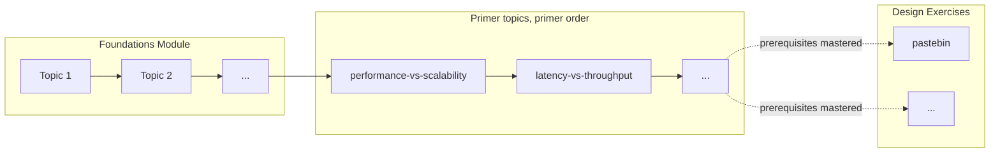

# Learning Path Implementation

How the app computes and shows the [[Learning Path]]: [[Foundations Module]] topics, then the primer [[Topic]]s, then the [[Design Exercise]]s. A step unlocks when the previous topic is mastered ([[Mastery Threshold]] met in a [[Round]] of the [[Mastery Loop]]). The path is the home screen of the app.

## Model

The path is **never stored**: it is computed from the database every time (topics, their mastery from the [[Mastery Loop Implementation|Mastery Loop]] read models, their rounds). Pure code in `src/main/path/model.ts` (`buildLearningPath`), types in `src/shared/learningPath.ts`.

Order:

1. Foundations Module topics (`topics.in_foundations_module`), by position. Zero or more.
2. The teachable primer topics, in primer order (the [[Source Corpus]] topics minus `NON_TEACHABLE_CORPUS_TOPIC_IDS`, see [[Corpus#Teachable topics]]).
3. One Design Exercise slot per primer [[Reference Solution]], in the order of `DESIGN_EXERCISE_PREREQUISITES`.

Topics that are neither (the dev fixture topic of the Quiz dev screen) are left out.

## Rules

| Step status | Topic step | Design Exercise step |
|---|---|---|
| `mastered` | A round of the topic once passed (`rounds.passed`), whatever came after | Not used yet (#15) |
| `locked` | Not the first step, previous topic not `mastered`, no progress of its own | Implemented, a prerequisite not `mastered` |
| `available` | Unlocked, mastery `not_started` | Implemented, every prerequisite `mastered` |
| `in_progress`, `skipped`, `limit_reached` | Unlocked, the topic's mastery | Not used |
| `coming_soon` | Not used | Not implemented yet (`IMPLEMENTED_DESIGN_EXERCISES`) |

- **Strict unlock**: only `mastered` unlocks the next step. A `skipped` or `limit_reached` topic keeps the next one locked; the lock message says why ("Master X first. It was skipped: come back to it with another angle.") with a "Go to X" button, and the recommended step points to that topic, so the learner is never stuck.
- **No regression**: once a round passed, the topic stays `mastered` even if a later round failed (possible from the dev Quiz screen).
- **Threshold changes never re-lock**: `rounds.passed` is stored at completion against the threshold of that time ([[Mastery Loop Implementation#State machine]]); the path only reads it.
- **Progress keeps a step open**: a topic that already has progress (lesson read, rounds played) is never shown `locked`, for example when Foundations Module topics are inserted before topics already started.
- **Design Exercises** do not unlock one another: each needs its own prerequisite topics. A prerequisite missing from the path never counts as mastered. An exercise that is not implemented is `coming_soon` and never startable, but still lists its missing prerequisites.
- **Recommended step** (`nextStepKey`, the "Continue" call to action): the first topic that is neither `mastered` nor `locked` (a skipped or limit_reached topic included), else the first `available` Design Exercise, else none.
- **Progress**: mastered topics over all topics (percent rounded down), and Design Exercises whose prerequisites are all mastered.

## Design Exercise prerequisites

Data file `src/main/path/designExercisePrerequisites.ts`, checked by a test against the bundled corpus (one entry per Reference Solution, teachable primer topics only). Chosen from what each primer solution relies on.

| Exercise | Prerequisite topics | Rationale |
|---|---|---|
| `pastebin` | performance-vs-scalability, load-balancer, database, cache | A read-heavy store behind web servers: SQL database and its scaling, a cache for hot pastes, load balancing. |
| `query_cache` | latency-vs-throughput, load-balancer, cache | A sharded in-memory LRU cache in front of a search service. |
| `web_crawler` | domain-name-system, database, cache, asynchronism | Queues of pages to crawl, NoSQL storage, duplicate detection, DNS lookups as a bottleneck. |
| `social_graph` | load-balancer, application-layer, database, cache | Person and lookup services over a sharded user graph. |
| `sales_rank` | database, cache, asynchronism | A batch (MapReduce) job writing a ranking table read through a cache. |
| `twitter` | performance-vs-scalability, content-delivery-network, load-balancer, application-layer, database, cache, asynchronism | Timeline fan-out and search at scale. |
| `mint` | load-balancer, application-layer, database, cache, asynchronism, security | Account sync and categorization with queues and workers, and the security of financial data. |
| `scaling_aws` | performance-vs-scalability, availability-patterns, domain-name-system, content-delivery-network, load-balancer, reverse-proxy-web-server, application-layer, database, cache, asynchronism | From one box to millions of users: every building block. |

`IMPLEMENTED_DESIGN_EXERCISES` is empty: #15 adds the real Design Exercises and lists them there.

## Service and IPC

`src/main/path/pathIpc.ts`: `getLearningPath({ db, corpus })` (topics with `listTopicMasteries`, `everMastered` from the rounds, primer order and Reference Solution titles from the corpus) and `createLearningPathIpc`.

| `window.api` | Channel | Notes |
|---|---|---|
| `getLearningPath()` | `path:get` | `LearningPath`: steps, `nextStepKey`, progress |
| `onLearningPathChanged(listener)` | `path:changed` | The recomputed path, pushed to the sender after `quiz:completeRound` and `mastery:choose` (`src/main/ipc/handlers.ts`) |

## Lock enforcement

The renderer only offers unlocked steps, but the main process does not trust it. `createTopicLockGuard({ db, corpus }, { allowLockedTopics })` (`src/main/path/lock.ts`) recomputes the path and throws a `GenerationError` with code `topic_locked` when the topic's step is `locked`, with a user-actionable message ("Cache is locked. Master Load balancer first, then come back from the Learning Path."). `src/main/index.ts` builds one guard with `allowLockedTopics: !app.isPackaged`, the dev flag of the dev screens, and injects it:

| Entry | Guarded | Refusal |
|---|---|---|
| `mastery:startRound` | yes | `error` event with code `topic_locked` on `mastery:event`, shown by the topic screen with its message |
| `mastery:startRemediation` | yes | same |
| `quiz:startRound` (dev Quiz screen, by quiz id) | yes, on the quiz's topic | the invoke rejects |

- Dev builds (`npm run dev`, unpackaged) open any topic, so the dev screens keep working.
- A topic with progress is never `locked` (see [[#Rules]]), so a topic already started is always allowed, even if Foundations Module topics were inserted before it.
- Topics outside the path (the dev fixture topic) are never locked.
- Also guarded: `lesson:start`. A read lesson counts as progress, which unlocks a topic, so without this guard a renderer could unlock a locked topic by opening its lesson first.

Tests: `src/main/mastery/service.test.ts` (mastery IPC: locked topic refused with `topic_locked` for a round and a Remediation Lesson and no Generation started, allowed in a dev build, topic with progress allowed), `src/main/ipc/quiz.test.ts` (`quiz:startRound` asks the guard with the quiz's topic).

## Screens

`src/renderer/src/path/`:

- `LearningPathScreen`: the home screen. Progress text and bar (`role="progressbar"`), the "Continue" button on the recommended step (label from its status: Start, Continue, Come back with another angle, Choose how to go on), then one section per stage with an ordered list of steps, a status badge each, the recommended step marked `aria-current="step"`. Locked steps are not buttons and explain what to master; Design Exercises show their missing prerequisites and rationale. Loaded on mount and on every `path:changed`.
- `PathTopicView`: a topic opened from the path, the Mastery Loop topic screen (`TopicScreen`) with a "Learning Path" back button. When a push shows the topic mastered, it offers the next unlocked step.
- `TopicScreen` remediation step: a failed round with no missed notion (no Remediation Lesson to read) shows "no missed notion was identified" and a retry button that starts the next round, instead of crashing; `firstRemediationIndex` (`src/renderer/src/mastery/masteryText.ts`, tested) returns null for it.
- `pathText.ts`: labels and messages (tested).

`src/renderer/src/App.tsx`: a `Screen` union (home, topic, settings, about, dev screens). The header has Settings and About. In dev builds a collapsed "Developer tools" section lists All topics (the former Learn list, `MasteryView`), Lessons, Quiz, Design canvas, the version and ping, and the Generation panel. Base styles (focus outline, header) in `src/renderer/src/app.css`.

## Verification (2026-10-09)

- Tests: `src/main/path/model.test.ts` (order, zero foundations, unknown topics, strict unlock after skipped and limit_reached, no regression, threshold independence, progress keeps a step open, recommended step, exercise prerequisites, coming soon, progress), `pathIpc.test.ts` (path from a migrated database with the bundled corpus, skip blocks, threshold change, prerequisites data against the corpus, push on `path:changed`), `src/renderer/src/path/pathText.test.ts`.
- Built app driven over the Chrome DevTools protocol, scratch `--user-data-dir`, `CLAUDE_CLI_PATH` set to a missing file (no Generation can run): fresh database (first Foundations Module topic recommended, the rest locked, 8 exercises coming soon); seeded database (6 foundations and `performance-vs-scalability` mastered, `latency-vs-throughput` skipped after 3 failed rounds): skipped badge, "Come back to Latency vs throughput with another angle", next topic locked with the skipped explanation and "Go to" button; "Come back now with another angle" recorded the choice (remediation step, CLI error shown as expected); an open round played in the UI and passed: the topic screen showed "Next step unlocked: Availability vs consistency" from the push, and the path showed 8 of 21 mastered with the next topic available, without restart.

## Related

- [[Learning Path]], [[Topic]], [[Foundations Module]], [[Design Exercise]], [[Reference Solution]]
- [[Mastery Loop Implementation]], [[Lesson View]], [[Corpus]]
