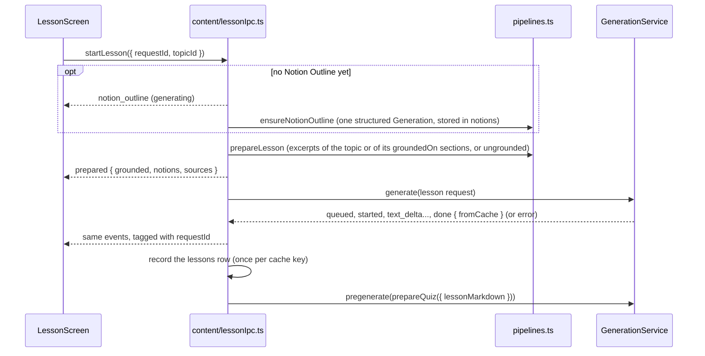

# Lesson View

The screen where the learner picks a [[Topic]] and reads its [[Lesson]] as it streams in. It runs the content pipelines of [[Prompts]] through the [[Generation Service]], reuses the [[Content Cache]], and starts the [[Quiz]] [[Pre-generation]] once the lesson is there. Entry point: the **Lessons** button of the home screen.

## Topic bootstrap

At startup `seedTopics` (`src/main/content/topics.ts`) inserts the missing `topics` rows, idempotently:

- one per [[Source Corpus]] topic (every `##` section of the primer, 22 at the pinned commit), slug = corpus topic id (`cache`, `latency-vs-throughput`), title = primer heading, `source_section` = the same id, positions `1000 + corpus order`;
- the [[Foundations Module]] topics passed as `FoundationsTopicSeed[]` (`in_foundations_module = 1`, no `source_section`, positions from 0, so they come first in the [[Learning Path]]; an optional `groundedOn` lists the primer sections a topic is grounded on, read back from the seed by slug). The app passes the six `FOUNDATIONS_TOPICS` (`src/main/content/foundations.ts`), see [[Foundations Module Content]].

Existing rows are never updated or deleted: notion, lesson and attempt rows reference topic ids.

## Flow



- A cache hit sends `prepared` then `done` with `fromCache: true` at once (about 40 ms in the app check below).
- The outline is shared by concurrent requests and is not tied to one request's cancellation: a cancelled request stops waiting for it, the outline is still stored.
- `cancelLesson` (or closing the window) aborts the lesson Generation; nothing is recorded.
- Errors end the stream with `{ type: 'error', error: { code, message } }`, the codes of [[Generation Service#Errors]] (`cli_not_found`, `not_logged_in`, `quota_or_rate_limit`...). Failures outside a Generation (for example a topic without a corpus section) come as `unknown` with their own message.
- The `lessons` row is what the learner saw ([[Data Model]]): created on `done` unless the topic already has one with the same `content_cache_key`.

> [!important] Quiz Pre-generation and the quiz screen
> The pre-generated quiz is `prepareQuiz(deps, topicId, firstRoundQuizOptions(lessonMarkdown, settings))` (`src/main/mastery/quizOptions.ts`), where `lessonMarkdown` is the lesson the learner read (latest `lessons` row of the topic). A foreground quiz request finds it in the Content Cache only with the same options: the first round of the [[Mastery Loop]] builds them with the same function ([[Mastery Loop Implementation]]). A failed Pre-generation is logged and not retried until the lesson is opened again.

## IPC

Declared in `src/shared/ipc.ts`, types in `src/shared/topic.ts` and `src/shared/lesson.ts`:

| `window.api` | Channel | Notes |
|---|---|---|
| `listTopics()` | `topic:list` | `TopicSummary[]` in Learning Path order, with `notionCount` |
| `getTopic({ topicId })` | `topic:get` | `TopicDetail`: `notionOutline` is `{ status: 'missing' }` or `{ status: 'ready', notions }` |
| `startLesson({ requestId, topicId })` | `lesson:start` | events follow on `lesson:event` |
| `cancelLesson({ requestId })` | `lesson:cancel` | |
| `onLessonEvent(listener)` | `lesson:event` | `{ requestId, event: LessonEvent }` |
| `getLessonReview({ topicId })` | `mastery:getLessonReview` | Read-only, from the database (see [[#Rereading a Lesson during a round]]); declared with the [[Mastery Loop Implementation|Mastery Loop]] channels |

`LessonEvent` = `notion_outline` | `prepared` | every `GenerationEvent`. Requests are validated with Zod in the main process.

## Rendering

`src/renderer/src/lesson/`:

- `LessonMarkdown.tsx`: the shared `MarkdownContent` (`src/renderer/src/markdown/`: `react-markdown` 10.1.0 + `remark-gfm` 4.0.1, tables, strikethrough, task lists) plus the source chips and notion anchors. Code blocks render as `<pre><code class="language-x">`, except ```` ```mermaid ```` blocks, drawn as a [[Diagram]] once their fence is closed (a "Diagram loading…" placeholder while it streams), see [[Mermaid Diagrams]]. **No raw HTML** (`skipHtml`), links only for `http(s)` URLs and opened in the OS browser, images replaced by their alt text. The same component renders [[Remediation Lesson|Remediation Lessons]] and [[Protocol Step Lesson|Protocol Step Lessons]]; each view passes `streaming` while its Generation runs.
- `citations.ts`: the `remarkLesson` plugin turns `[source: <section id>]` in text nodes (never in code) into source chips, and `<!-- notion: <slug> -->` markers into hidden anchors used by the notion buttons of the header. A chip shows the section's last heading and opens its primer permalink; an id that is not among the lesson's excerpts shows as a dashed "unknown" chip.
- `textBuffer.ts`: text deltas are batched (one render per 80 ms at most); auto-scroll follows the stream only while the learner stays within 48 px of the bottom.
- `lessonState.ts`: reducer of the screen states (`starting`, `outline`, `queued`, `generating`, `done`, `cancelled`, `error`), error titles per code.
- Badges: "System Design Primer" (grounded, including the grounded Foundations Module topic `orders-of-magnitude`) or **"Outside the primer"** (ungrounded Foundations Module topics; before `prepared`, from `TopicSummary.grounded`), and "From cache" or "Generated" once done. A Sources footer lists the excerpts with the CC BY 4.0 notice.
- Retry remounts the screen with a new request. Leaving the screen cancels a running request. Errors use the shared `GenerationErrorView` (title, advice, "Open Settings" for `not_logged_in` and `cli_not_found`, folded technical details, see [[Generation Service#Error display]]).
- `embedded` (default `false`): inside the topic screen of the [[Mastery Loop Implementation|Mastery Loop]], `LessonScreen` shows neither the topic title nor the Outside the primer badge, which the topic screen's heading and progress line already show (#21). The standalone Lessons (dev) screen keeps both.

Not done: syntax highlighting (no highlighter bundled). Mermaid Diagrams are rendered (#22, mermaid loaded lazily) and the lesson prompts ask for them (#23). Diagrams are checked and repaired in the main process after the stream ends (see [[Mermaid Diagrams#Generation side (#23)]]), so the text of the `done` event can differ from the streamed text in its ```` ```mermaid ```` blocks: the reducer already replaces the streamed text with `done`'s content, which is what the [[Content Cache]] and the `lessons` row hold. The repair adds a few seconds between the end of the stream and `done`, shown as still generating.

## Rereading a Lesson during a round

Issue #35: once the first round starts, the topic screen no longer shows the Lesson, and reopening a topic resumes the open round directly. The **Lesson** button of the topic header (see [[Mastery Loop Implementation#Topic screen]]) opens the recorded Lesson and the Remediation Lessons again at any time, including in the middle of a question.

- **Not a generation**: the panel reads the `lessons` and `remediation_lessons` rows through `mastery:getLessonReview` (`src/main/mastery/review.ts`). It never starts a `lesson:start` request, never goes through the Generation Service, never misses the [[Content Cache]], never calls the CLI, and writes nothing. The Markdown is what the learner read: for a Lesson, the `done` text, Diagrams checked and repaired included.
- **Rendering**: `LessonReviewPanel` (`src/renderer/src/mastery/`) puts `LessonMarkdown` in the same `.lesson-scroll` / `.lesson-body` reading column and the same Sources footer (`LessonSources.tsx`, extracted from `LessonScreen`) as the lesson screen, so source chips and Mermaid Diagrams work the same. The panel shows the "System Design Primer" chip of a grounded reading. The Outside the primer badge stays on the progress line.
- **Selection**: tabs, "Lesson" first, then the Remediation Lessons newest round first, each labelled with its notion (French), round and angle. No tab when there is a single reading.
- **Locked topics**: the IPC calls the same `assertTopicUnlocked` guard as a Round; outside dev builds a locked topic gets the `topic_locked` error, shown in the panel.
- **No lost state**: the quiz is hidden, not unmounted, while the panel is open (see [[Mastery Loop Implementation#Topic screen]]).

## Visual design

Issue #32, on the tokens of [[Design System]] (dark only). The reading column is `.lesson-body` (`lesson.css`): `body-lg` (16px / 26px) in Geist, 50rem wide, left-aligned under the topic header. Headings step down visibly: `h1` `headline-lg`, `h2` `headline-md` with a hairline rule above (except the first heading), `h3` `headline-sm`, `h4` and below in secondary text. Lists use muted markers, blockquotes are hairline-framed quotes on `surface-base` in secondary text, tables (`.lesson-table`, `markdown.css`) have a hairline frame, mono caps header cells and no vertical rules, inline code and code blocks are JetBrains Mono on the shared `code` and `pre` styles. A source chip is a small mono pill in the in-progress colors that opens the primer section; an unknown id keeps its dashed red frame and its `?`. The badges are shared chips: "System Design Primer" and "From cache" / "Generated" are neutral, **Outside the primer** (`OutsidePrimerBadge`) is the amber `chip-attention`. The header puts the badges and the notion buttons on one row to leave the height to the text. The streaming indicator (the shared `.status-strip` with a `.spinner`) is an indigo-tinted strip with a spinner, the step in progress and Cancel; the spinner slows down under `prefers-reduced-motion`. The Sources footer is a `surface-base` card with a mono caps title. Generation errors (`GenerationErrorView`, the shared `.notice-card .notice-card-error`) are a red-tinted card with a "!" mark before the title (never color alone), the actions on one row and the raw message folded in a mono read-only text area.

## Verification (2026-10-09)

Built app driven over the Chrome DevTools protocol, `CLAUDE_CLI_PATH` pointing to a wrapper that forwards at most 2 calls to the real CLI and fails the rest:

- First open of `latency-vs-throughput`: outline 5 s, lesson streamed from 8 s to 21 s (about 4 980 characters, 4 notion sections, recap), 4 source chips with valid ids, no raw citation or marker text, "Generated" badge. The quiz Pre-generation started right after (third call, refused by the wrapper, logged as failed).
- Second open on a copy of that database: rendered from the Content Cache in about 40 ms, "From cache" badge, no CLI call except the quiz Pre-generation (refused).
- Not checked in the app: an ungrounded lesson generated by the real CLI (covered by unit tests and the fake CLI, see [[Foundations Module Content]]), the error screens with a real CLI failure, the chip click opening the browser.

## Verification of the topic screen headings and auth errors (2026-10-09, #20, #21)

- Automated: `src/renderer/src/path/topicHeadings.test.ts` renders the topic screen's parts with `react-dom/server` (no DOM): from the Learning Path the title appears once, as the only heading (`h1`), the Outside the primer badge once, in the order title, progress line, lesson; the standalone `LessonScreen` and `TopicHeader` keep their `h2`.
- Manual check, done on the built app over the Chrome DevTools protocol with a scratch `--user-data-dir`, `CLAUDE_CONFIG_DIR` unset and `CLAUDE_CLI_PATH` pointing to a fake CLI that fails every call with "Failed to authenticate: OAuth session expired and could not be refreshed" and logs the `CLAUDE_CONFIG_DIR` it gets: open the first topic from the Learning Path. Expected and seen: one heading (the `h1` title), one Outside the primer badge, the lesson error "Claude Code is not logged in" with what to do and "Open Settings" next to Retry. "Open Settings" opens Settings; "Test" reports "Not logged in" for `~/.claude` with the `/login` instructions; a missing directory is refused on save; after setting an existing directory, "Test" reports it logged in, and Back returns to the topic, whose new lesson call got `CLAUDE_CONFIG_DIR` (no restart).

## In code

- `src/main/content/`: `seedTopics`, `listTopicSummaries`, `getTopicDetail` (`topics.ts`); `createLessonIpc` (`lessonIpc.ts`); tests in `content.test.ts`.
- `src/renderer/src/lesson/`: `LessonView`, `LessonScreen`, `LessonMarkdown`, `LessonSources`; tests in `lesson.test.ts`.
- Rereading (#35): `src/main/mastery/review.ts` (`getLessonReview`), `src/renderer/src/mastery/LessonReviewPanel.tsx` and `lessonReview.ts`; tests `review.test.ts`, `lessonReview.test.ts`.
- `src/renderer/src/markdown/`: `MarkdownContent`, `MermaidDiagram` ([[Mermaid Diagrams]]); tests in `markdown.test.ts`.

## Related

- [[Lesson]], [[Topic]], [[Notion Outline]], [[Grounding]], [[Pre-generation]], [[Content Cache]]
- [[Prompts]], [[Generation Service]], [[Mermaid Diagrams]], [[Diagram]]
