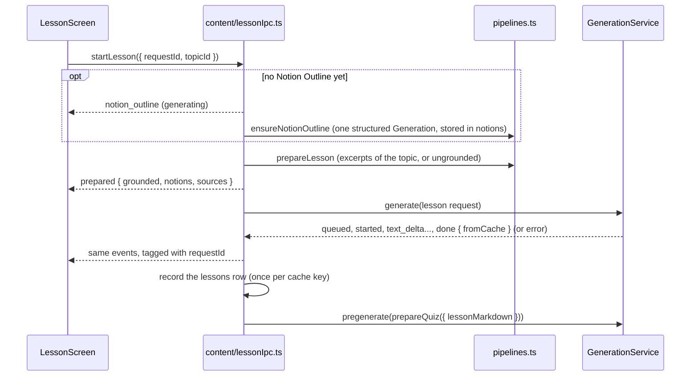

# Lesson View

The screen where the learner picks a [[Topic]] and reads its [[Lesson]] as it streams in. It runs the content pipelines of [[Prompts]] through the [[Generation Service]], reuses the [[Content Cache]], and starts the [[Quiz]] [[Pre-generation]] once the lesson is there. Entry point: the **Lessons** button of the home screen.

## Topic bootstrap

At startup `seedTopics` (`src/main/content/topics.ts`) inserts the missing `topics` rows, idempotently:

- one per [[Source Corpus]] topic (every `##` section of the primer, 22 at the pinned commit), slug = corpus topic id (`cache`, `latency-vs-throughput`), title = primer heading, `source_section` = the same id, positions `1000 + corpus order`;
- the [[Foundations Module]] topics passed as `FoundationsTopicSeed[]` (`in_foundations_module = 1`, no `source_section`, positions from 0, so they come first in the [[Learning Path]]). None are defined yet: the app passes an empty list.

Existing rows are never updated or deleted: notion, lesson and attempt rows reference topic ids.

## Flow

- A cache hit sends `prepared` then `done` with `fromCache: true` at once (about 40 ms in the app check below).
- The outline is shared by concurrent requests and is not tied to one request's cancellation: a cancelled request stops waiting for it, the outline is still stored.
- `cancelLesson` (or closing the window) aborts the lesson Generation; nothing is recorded.
- Errors end the stream with `{ type: 'error', error: { code, message } }`, the codes of [[Generation Service#Errors]] (`cli_not_found`, `not_logged_in`, `quota_or_rate_limit`...). Failures outside a Generation (for example a topic without a corpus section) come as `unknown` with their own message.
- The `lessons` row is what the learner saw ([[Data Model]]): created on `done` unless the topic already has one with the same `content_cache_key`.

> [!important] Quiz Pre-generation and the quiz screen
> The pre-generated quiz is `prepareQuiz(deps, topicId, { lessonMarkdown })` with default options, where `lessonMarkdown` is the lesson the learner read (latest `lessons` row of the topic). A foreground quiz request finds it in the Content Cache only with the same options. A failed Pre-generation is logged and not retried until the lesson is opened again.

## IPC

Declared in `src/shared/ipc.ts`, types in `src/shared/topic.ts` and `src/shared/lesson.ts`:

| `window.api` | Channel | Notes |
|---|---|---|
| `listTopics()` | `topic:list` | `TopicSummary[]` in Learning Path order, with `notionCount` |
| `getTopic({ topicId })` | `topic:get` | `TopicDetail`: `notionOutline` is `{ status: 'missing' }` or `{ status: 'ready', notions }` |
| `startLesson({ requestId, topicId })` | `lesson:start` | events follow on `lesson:event` |
| `cancelLesson({ requestId })` | `lesson:cancel` | |
| `onLessonEvent(listener)` | `lesson:event` | `{ requestId, event: LessonEvent }` |

`LessonEvent` = `notion_outline` | `prepared` | every `GenerationEvent`. Requests are validated with Zod in the main process.

## Rendering

`src/renderer/src/lesson/`:

- `LessonMarkdown.tsx`: `react-markdown` 10.1.0 + `remark-gfm` 4.0.1 (tables, strikethrough, task lists), code blocks as `<pre><code class="language-x">`. **No raw HTML** (`skipHtml`), links only for `http(s)` URLs and opened in the OS browser, images replaced by their alt text.
- `citations.ts`: the `remarkLesson` plugin turns `[source: <section id>]` in text nodes (never in code) into source chips, and `<!-- notion: <slug> -->` markers into hidden anchors used by the notion buttons of the header. A chip shows the section's last heading and opens its primer permalink; an id that is not among the lesson's excerpts shows as a dashed "unknown" chip.
- `textBuffer.ts`: text deltas are batched (one render per 80 ms at most); auto-scroll follows the stream only while the learner stays within 48 px of the bottom.
- `lessonState.ts`: reducer of the screen states (`starting`, `outline`, `queued`, `generating`, `done`, `cancelled`, `error`), error titles per code.
- Badges: "System Design Primer" (grounded) or **"Outside the primer"** (ungrounded, Foundations Module), and "From cache" or "Generated" once done. A Sources footer lists the excerpts with the CC BY 4.0 notice.
- Retry remounts the screen with a new request. Leaving the screen cancels a running request.

Not done: syntax highlighting (no highlighter bundled) and Mermaid diagrams (the lesson prompt asks for neither, and Mermaid adds a large bundle); a fenced `mermaid` block renders as code.

## Verification (2026-10-09)

Built app driven over the Chrome DevTools protocol, `CLAUDE_CLI_PATH` pointing to a wrapper that forwards at most 2 calls to the real CLI and fails the rest:

- First open of `latency-vs-throughput`: outline 5 s, lesson streamed from 8 s to 21 s (about 4 980 characters, 4 notion sections, recap), 4 source chips with valid ids, no raw citation or marker text, "Generated" badge. The quiz Pre-generation started right after (third call, refused by the wrapper, logged as failed).
- Second open on a copy of that database: rendered from the Content Cache in about 40 ms, "From cache" badge, no CLI call except the quiz Pre-generation (refused).
- Not checked in the app: an ungrounded lesson (no Foundations Module topic exists yet; covered by unit tests), the error screens with a real CLI failure, the chip click opening the browser.

## In code

- `src/main/content/`: `seedTopics`, `listTopicSummaries`, `getTopicDetail` (`topics.ts`); `createLessonIpc` (`lessonIpc.ts`); tests in `content.test.ts`.
- `src/renderer/src/lesson/`: `LessonView`, `LessonScreen`, `LessonMarkdown`; tests in `lesson.test.ts`.

## Related

- [[Lesson]], [[Topic]], [[Notion Outline]], [[Grounding]], [[Pre-generation]], [[Content Cache]]
- [[Prompts]], [[Generation Service]]
