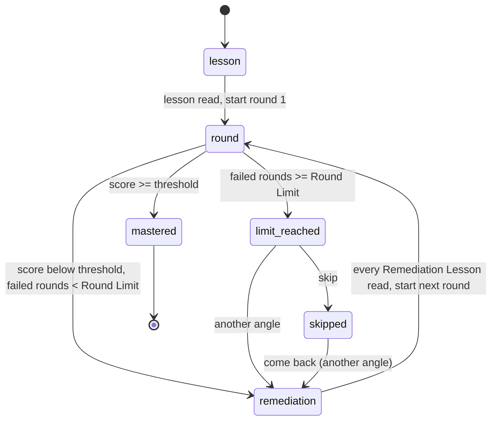

# Mastery Loop Implementation

How the app drives a [[Topic]] through the [[Mastery Loop]]: [[Lesson]], [[Quiz]] played as a [[Round]], results per [[Notion]], one [[Remediation Lesson]] per missed notion, a new quiz with fresh questions, and so on until the [[Mastery Threshold]] is met, bounded by the [[Round Limit]]. Built on the [[Quiz Engine]], the [[Lesson View]] and the [[Prompts]]. Settings screen included.

## State machine

The loop has no stored "current step": the step is **derived from the database** every time (rounds, their per-notion scores, Remediation Lessons, Round Limit choices, settings). So it survives restarts and never drifts from the history. Pure code in `src/main/mastery/state.ts` (`deriveMastery`), snapshot loaded by `loadMasterySnapshot` (`queries.ts`).

| Step | When | Topic mastery |
|---|---|---|
| `lesson` | No round yet. `lessonReady` once a `lessons` row exists. | `not_started` (no lesson, no round) or `in_progress` (lesson recorded, or a round opened and left) |
| `round` | A round is open (started, not completed) with a number above the last completed one: it is **resumed**, never restarted. | `in_progress` |
| `remediation` | The latest completed round failed and the limit is not reached, or the learner chose another angle. Targets: the missed notions with their angle and whether their Remediation Lesson is recorded. | `in_progress` |
| `limit_reached` | Failed rounds since the last passed one >= Round Limit, no choice recorded on the latest round. | `limit_reached` |
| `skipped` | `skip` chosen on the latest round. | `skipped` |
| `mastered` | The latest completed round passed. | `mastered` |

Rules:

- **Topic status** (#25): the status of `deriveMastery` is the only topic status of the app, read through `getTopicMastery` by the topic header (`mastery:getState`), the [[Learning Path]] (and so its recommended step) and the [[Dashboard]] topics table. A topic is `not_started` until a [[Lesson]] is recorded (`lessons` row, written before the lesson's `done` event is sent) or a [[Round]] is opened (an open or abandoned one included); then `in_progress` until `mastered`, `skipped` or `limit_reached`. A topic with progress is never `locked` on the path. The topic screen reloads the state when the lesson is done and when a round opens, so the header shows "In progress" with the round/attempt line during the lesson and round 1; before the lesson it reads "Read the lesson, then take round 1".
- **Round Limit count** = completed rounds below the threshold since the last passed round (`failedRoundsSinceLastPass`). An open (abandoned) round never counts; it keeps its number when resumed, so a number is never burnt twice. Numbers are unique per topic and never restart ([[Quiz Engine#Round lifecycle]]).
- **Missed notion** = per-notion score below the current Mastery Threshold (`missedNotions`). If a failed round has none (possible below 100%: a question on two notions counts for both), the notions with a wrong answer are targeted, so a failed round always has remediation.
- **Threshold changes**: `rounds.passed` is stored at completion, so a later change never passes or fails a past round; it changes the targets of the current remediation and the next rounds. A changed Round Limit applies at once (a remediation step can turn into `limit_reached`).
- **Angles**: each Remediation Lesson on a notion takes the next angle not used yet for it, in the order `concrete_example`, `analogy`, `contrast`, `guided_questions` (then cycles), and the prompt gets the `usedAngles` ("use a clearly different style, example and situation"). With the default limit of 3, "another angle" gets `contrast`, a style the learner has not read.
- **At the Round Limit**: "another angle" records `another_angle` on the latest round (remediation with a new angle, then a new round); "skip" records `skip`. A failure after another angle offers the choice again: there is no endless loop. Coming back to a skipped topic records `another_angle` on the same round.
- `cannotStartRound(step)` and `cannotChoose(step, choice)` are the guards; the service refuses an action they reject.

## Service and IPC

`createMasteryService` (`src/main/mastery/service.ts`):

- `startRound(topicId)`: resumes the open round, or builds the next quiz request, runs it through the [[Generation Service]] (a [[Content Cache]] hit when pre-generated), stores the quiz (`saveQuiz`; an unplayed quiz with the same cache key is reused, in case the app quit between storing and starting) and starts the round with the quiz service.
- Quiz options (`quizOptions.ts`): round 1 = `firstRoundQuizOptions(lessonMarkdown, settings)`, **the same function the lesson flow uses for its [[Pre-generation]]**, so the first round is a cache hit (tested by comparing cache keys and counting CLI calls). Next rounds = `{ lessonMarkdown, focusNotions: missed, reminderNotions: the others, avoidPrompts: every prompt of the quizzes played on the topic }`. `count` only when the "questions per quiz" setting is set.
- `prepareRemediation` / `recordRemediation`: the Remediation Lesson request of a target (angle, `usedAngles`, the prompts of the questions missed on that notion), and the `remediation_lessons` row (with the round), once per round and notion.
- `pregenerateRemediationStep`: when the first Remediation Lesson of a step is opened, the other ones and the next quiz are pre-generated in the background.
- `choose(topicId, choice)`: the Round Limit choice.

`createMasteryIpc` (`masteryIpc.ts`), channels in `src/shared/ipc.ts`, types in `src/shared/mastery.ts`:

| `window.api` | Channel | Notes |
|---|---|---|
| `listMasteryTopics()` | `mastery:listTopics` | Topics with their mastery |
| `getMasteryState({ topicId })` | `mastery:getState` | `MasteryState`: step, round number, failed rounds, threshold, limit, last round |
| `startMasteryRound({ requestId, topicId })` | `mastery:startRound` | Events `queued`, `started`, `retry`, `error`, then `round_ready { start }`. The quiz `done` event is never sent: it holds the answer keys. |
| `startRemediation({ requestId, topicId, notionId })` | `mastery:startRemediation` | Lesson events: `prepared`, then the streamed Generation events |
| `cancelMastery({ requestId })` | `mastery:cancel` | A closed window cancels its requests too |
| `getLessonReview({ topicId })` | `mastery:getLessonReview` | Read-only (#35): `LessonReview` = the latest recorded Lesson and every recorded Remediation Lesson of the topic, newest round first. Refused for a locked topic (`assertTopicUnlocked`) like a Round. Never generates, never records. |
| `chooseAtRoundLimit({ topicId, choice })` | `mastery:choose` | `another_angle` or `skip` |
| `onMasteryEvent(listener)` | `mastery:event` | `{ requestId, event }` |

Errors end a stream with a typed `{ code, message }` ([[Generation Service#Errors]]).

`getLessonReview(db, corpus, topicId)` (`review.ts`): the latest `lessons` row (Markdown as recorded, with its source chips from `lessonSources`) and the `remediation_lessons` rows of the topic's notions, sorted by round number descending (a lesson without a known round last, recording order within a round). The angle is not stored: it is the lesson's rank among the Remediation Lessons of the same notion, the same rule the loop uses to pick the next angle (`remediationAngle`). Only `SELECT`s on the database: no Generation Service, no Content Cache access, no CLI call, no row written.

Read models for the [[Notion Map]] (#17) and the [[Dashboard]] (#18), in `queries.ts`: `getTopicMastery(db, topicId)`, `listTopicMasteries(db)`, `latestNotionScores(db, topicId)` (per notion, the score in the most recent completed round that tested it), `roundNotionScores(db, round)`.

## Topic screen

`src/renderer/src/mastery/`: a topic opened from the [[Learning Path Implementation|Learning Path]] home screen shows `TopicScreen` (the dev-only "All topics (dev)" entry keeps `MasteryView`, the topic list with mastery badges):

- Heading hierarchy (#21): the topic title once, as the screen heading (`PathTopicView`'s `h1`, next to the back button), then the progress line, then the step content. `TopicScreen` takes `showTitle` (default `true`, so the dev "All topics" screen keeps its `h2`; `PathTopicView` passes `false`) and renders `LessonScreen` with `embedded`, which drops its own title and Outside the primer badge. The round results inside the topic screen do not repeat the badge either.
- Progress line (`TopicHeader`): status badge, the Outside the primer badge (the only one on the screen), round number, "attempt k of N before the Round Limit", Mastery Threshold.
- `lesson`: the [[Lesson View]] screen (`LessonScreen`, streamed or from cache), then "Take the quiz".
- Round: the quiz player of the [[Quiz Engine]] (`QuizPlayer`, unchanged), then `QuizResults` with the per-notion breakdown and "Continue".
- `remediation`: one tab per missed notion with its score, the streamed Remediation Lesson (`RemediationLesson`, with its angle and "Generated" / "From cache"), "Next notion", then "Start round N" once all are recorded.
- `limit_reached`: the two choices; `skipped`: "Come back now with another angle"; `mastered`: the passing round.
- Cancel while a quiz or a Remediation Lesson is generated, typed error titles, Retry. Leaving the screen cancels running requests; reopening the topic resumes the step (an open round is resumed at once).

- **Lesson button** (#35): in the progress line, secondary style, `data-testid="lesson-review-button"`. Offered in every step as soon as a [[Lesson]] exists (`canReviewLesson`, `lessonReview.ts`): during a round (any question), on the results screen, in `remediation`, `limit_reached`, `skipped` and `mastered`, and while the first round's quiz is being prepared. Not offered in the plain `lesson` step (the Lesson is the screen) nor before the Lesson is recorded (`lessonReady` false), so there is nothing to open. It opens the reading panel (below) and toggles it.
- **Reading panel** (`LessonReviewPanel.tsx`): a full-width panel that takes the place of the step area (works at 800px: the tabs wrap, the reading column is at most 50rem), with a Close button; Escape closes it; the focus moves to its heading on open and back to the Lesson button on close. It lists the readings as tabs: "Lesson" first, then the Remediation Lessons newest round first (notion title in French, "Round 2 · Analogy" beside it); a single reading shows no tabs. It renders through the same `LessonMarkdown` (source chips, Diagrams) and Sources footer (`LessonSources`, shared with `LessonScreen`) as the lesson screen. It is mounted only while open and loads `getLessonReview` each time, so it shows what is recorded now. Empty state: "No Lesson is recorded for this topic yet." (for example `limit_reached` with no recorded Lesson, which only dev data can produce). A refusal (locked topic) shows as a `GenerationErrorView` in the panel.
- **Nothing is lost by reading**: the step content (`.mastery-step`: quiz player, results, preparation, remediation, outcomes) stays mounted and is hidden with the `hidden` attribute while the panel is open, not unmounted. So the quiz player keeps its current question, the selected choices, the typed free answer and the postponed questions, the results screen stays as it was, and a Remediation Lesson being generated keeps streaming in the background. Closing the panel shows the step exactly where it was left. Reading never calls `startRound`, `startRemediation`, `lesson:start` or a Generation, and records nothing: no attempt, no `lessons` row, no mastery change (the status derivation reads rounds, lessons and Remediation Lessons, none of which reading writes).

The separate Lessons and Quiz screens stay reachable in dev builds only ("Lessons (dev)", "Quiz (dev)").

## Visual design

Issue #32 (tokens: [[Design System]]). The topic header (`TopicHeader`) is one layer 1 card: on the left the mastery status as a chip with its glowing dot (`masteryChip` in `masteryText.ts`: Not started neutral, In progress indigo, Mastered emerald, Round Limit reached red, Skipped amber, the label always written), the Outside the primer chip when it applies, and the progress sentence (`roundProgress`); on the right the figures of the loop (`RoundStats`): the round number, failed rounds against the Round Limit with a 4px bar (`attemptsStat`, amber, red once the limit is reached), the latest completed round with its score and a Passed / Not passed chip, and the Mastery Threshold. Only data of `MasteryState` is shown: there is no rounds history in the loop state, so earlier rounds are not listed. The main action of a step is the one solid `btn-primary` of the action bar at the bottom of the topic ("Take the quiz", "Start round N", "Retry: start round N", "Continue"); the bar stays in view (`position: sticky`) while the step scrolls. Remediation shows its missed notions as tab-like buttons (selected: elevated surface and active border; a "✓" when the Remediation Lesson is read; the score in mono), then the lesson with an "Angle" chip. The outcomes (Round Limit reached, Topic skipped, Topic mastered) are cards with a red, amber or emerald border; the two Round Limit choices are two elevated cards, "Try another angle" being the primary action.

## Settings

`SettingsScreen` (`src/renderer/src/settings/`), `settings:get` / `settings:update` / `settings:testCli` (`src/main/settings/`), validation shared in `src/shared/settings.ts` (`settingsErrors`):

| Setting | Key | Default | Valid |
|---|---|---|---|
| Mastery Threshold | `mastery_threshold` | 100 | whole percent 50 to 100 |
| Round Limit | `round_limit` | 3 | 1 to 10 |
| Questions per quiz | `questions_per_quiz` | `null` (automatic: max(6, targeted notions)) | 4 to 20 |
| Claude Code CLI path | `claude_cli_path` | `null` (automatic lookup) | absolute path |
| Claude config directory | `claude_config_dir` | `null` (inherit the environment) | absolute path of an existing directory |

Applied without restart: the threshold and limit are read on every action; a CLI path change calls `GenerationService.resetCliPath()`, so the next Generation resolves it again; the Claude config directory is read on every CLI call and passed as `CLAUDE_CONFIG_DIR` ([[Generation Service#Claude profile]]). The path setting wins over the `CLAUDE_CLI_PATH` environment variable, which stays as a fallback for development and tests. "Test" resolves the CLI like a Generation does (configured path first, no silent fallback), runs `claude --version`, then `claude auth status --json` in the configured profile, and shows the login state, auth method, account email and config directory, with what to do when logged out.

`claude_config_dir` was added without a migration (the `settings` table is key/value): `getSettings` reads it as `null` until the first save writes the row (`unseededDefaults` in `src/main/db/repositories/settings.ts`).

"Open Settings": every Generation error display (lesson, Remediation Lesson, quiz preparation, free-answer grading, Protocol Step Lesson and protocol calls, dev Generation panel) is `GenerationErrorView` ([[Generation Service#Error display]]); for `not_logged_in` and `cli_not_found` it shows "Open Settings" next to Retry, which opens the Settings screen (`OpenSettingsContext`, provided by `App`; Back returns to the screen it was opened from).

## Data

Migration 3 `mastery-loop` ([[Data Model]]): table `round_limit_choices (round_id PK, choice)` (repository `src/main/db/repositories/mastery.ts`), settings `questions_per_quiz` and `claude_cli_path`. Remediation Lesson prompt version `remediation-lesson-2` (two new angles, `usedAngles`).

## Verification (2026-10-09)

- `npm run lint`, `format:check`, `typecheck`, `test`, `build` pass. Tests: `src/main/mastery/state.test.ts` (transitions: pass first time, fail then remediation then pass, limit reached with both choices and a second limit, abandoned round resumed and not counted, stale open round, threshold and limit changes), `service.test.ts` (first quiz served by the lesson Pre-generation, with automatic and fixed question counts; `avoidPrompts`, focus and reminder notions; remediation only on missed notions, cached and recorded once; resume after restart without a Generation; IPC events without the quiz content; typed CLI error), `src/main/settings/settings.test.ts`, `src/renderer/src/mastery/masteryText.test.ts`.
- Built app driven over the Chrome DevTools protocol, scratch `--user-data-dir`, `CLAUDE_CLI_PATH` pointing to a deterministic fake CLI (outline, lesson, quiz built from the JSON schema, Remediation Lesson, free-answer grading):
  - Full loop on `cache`: round 1 failed on one notion (66.7%) → 1 Remediation Lesson (`concrete_example`) → round 2, app quit after 2 answers and relaunched: resumed at question 3 of round 2 → failed → Remediation Lesson (`analogy`) → round 3 passed → Mastered. 3 quiz CLI calls in total, all Pre-generations (the lesson flow's, then one per remediation step): each round start was a cache hit. Database: rounds 1, 2, 3 with `passed` 0, 0, 1; 6 attempts per round; 2 `remediation_lessons` rows tied to rounds 1 and 2; quiz cache inputs with `targetNotions` = the missed notion and `avoidPrompts` of 6 then 12 prompts.
  - Round Limit on `load-balancer`, with `CLAUDE_CLI_PATH` set to a missing file and the fake set in the Settings screen ("Test" showed its version; Round Limit 0 refused, 2 saved): round 1 failed on 2 notions → 2 Remediation Lessons (the second one from the cache, pre-generated) → round 2 failed → Round Limit screen → Skip (list shows "Skipped") → Come back with another angle (`analogy`) → round 3 passed → Mastered. Every Generation went through the path from the settings.
- Not checked in the app: a real CLI, the error and Cancel paths of the topic screen (covered by unit tests only), the "another angle" button itself (the same choice as "come back", which was clicked), a Foundations Module topic.

## Verification of the Lesson button (2026-10-10, #35)

- Automated: `src/main/mastery/review.test.ts` (in-memory database: the latest Lesson and its sources, Remediation Lessons newest round first with round number, notion and angle, topics not mixed, unknown topic; IPC: validation, locked topic refused outside dev builds and served in dev builds, a topic with progress served, **the CLI runner never called and no table changed**), `src/renderer/src/mastery/lessonReview.test.ts` (the Lesson button in every step and overlay, the tabs and their order, the panel rendered with `react-dom/server`: tabs, selected reading, empty, loading and error states).
- Built app driven over the Chrome DevTools protocol (scratch `--user-data-dir`, fake CLI that logs every call): open round with the free answer typed mid-question, a choice selected and not submitted, the results screen, the remediation step (4 Remediation Lessons from 2 rounds, a Diagram in the Lesson and in a Remediation Lesson), `limit_reached` without a Lesson (empty state), 800px width. Typed text, selected choice and question number were identical after Escape and after Close; focus returned to the Lesson button; the quiz player and results screen were mounted inside a `hidden` container while the panel was open; row counts (attempts, rounds, lessons, Remediation Lessons, quizzes, Content Cache) and the fake CLI call log were unchanged by opening and closing the panel. The button was absent while the first Lesson streamed and on the lesson screen, and present once "Take the quiz" was clicked.
- Not checked in the app: a locked topic in a packaged app (covered by the IPC test; dev builds allow every topic), a real CLI.

## Related

- [[Mastery Loop]], [[Round]], [[Round Limit]], [[Mastery Threshold]], [[Remediation Lesson]], [[Notion]]
- [[Quiz Engine]], [[Lesson View]], [[Prompts]], [[Generation Service]], [[Data Model]]
