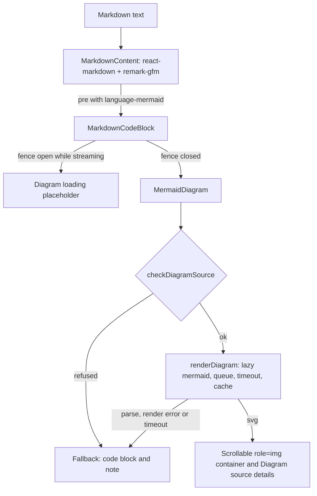

# Mermaid Diagrams

How a [[Diagram]] (a ```` ```mermaid ```` block in generated Markdown) is drawn in the app. Every Markdown view goes through one shared renderer, so [[Lesson|lessons]], [[Remediation Lesson|Remediation Lessons]] and [[Protocol Step Lesson|Protocol Step Lessons]] all get Diagrams. Generating them is #23 (prompts) and #24 (quiz scenario questions); this note covers rendering only.

## How it works



- `src/renderer/src/markdown/MarkdownContent.tsx`: `MarkdownContent`, the one Markdown renderer (GFM, no raw HTML via `skipHtml`, http(s) links only, images shown as their alt, tables in a scroll wrapper). Its `pre` component, `MarkdownCodeBlock`, is the code block hook: a `mermaid` block becomes a `MermaidDiagram`, any other block stays `<pre><code>`. `LessonMarkdown` (`src/renderer/src/lesson/`) is `MarkdownContent` plus the source chips and notion anchors.
- `src/renderer/src/markdown/MermaidDiagram.tsx`: `MermaidDiagram`, `DiagramLoading`.
- `src/renderer/src/markdown/mermaidRenderer.ts`: lazy `import('mermaid')`, initialization, render queue, timeout, session cache.
- `src/renderer/src/markdown/diagramSource.ts`: pure helpers (fence detection, source checks and limits, render plan, memo keys, labels, error messages). Tested in `markdown.test.ts`.
- `src/renderer/src/dev/DiagramDevScreen.tsx` and `diagramFixtures.ts`: **Diagrams (dev)** under Developer tools on the home screen (dev builds only). One fixture per supported type, the failing cases, a stream simulator (slider plus a "streaming" checkbox) and the list of `onDiagramError` events. No Claude call.

### Loading

- `mermaid` is pinned to **12.0.0** (MIT; 12.1.0 was one week old when chosen). It has no install script.
- It is only imported by the first Diagram on screen (`import('mermaid')`), and mermaid loads each diagram type's code on demand. Build sizes: main renderer chunk 9,276 kB before, 9,299 kB after (+22 kB: the Markdown components, the dev screen and its fixtures); `mermaid.core` 1,178 kB, loaded lazily, plus per-type chunks (flowchart, sequence, class, state, ER, and `elk`, 3.3 MB, which was fetched with the first Diagrams in the check below). The assets folder grows from about 9.4 MB to 19.7 MB on disk.
- Initialized once: `startOnLoad: false`, `securityLevel: 'strict'` (mermaid sanitizes the SVG with DOMPurify, no click handlers), `htmlLabels: false` (labels are SVG text, never HTML in a `foreignObject`), `suppressErrorRendering: true` (no error bomb in the page), `maxTextSize` and `maxEdges` from the limits below, theme `base` with the app's colours (dark text on the source-chip blue `#f0f4fc`, grey lines) and the system font (no web font is loaded). `secure` lists every key a diagram must not override (theme, fonts, security level, limits).

### Ids and memoization

- Memo key: FNV-1a hash of the normalized source (line endings, trailing spaces, outer blank lines) plus its length (`diagramKey`). The render cache (one result per key for the session) and the ids use it.
- mermaid renders with id `mermaid-<key>`; each instance on the page rewrites it to `diagram-<React useId>-<key>`, so two identical Diagrams on a page keep unique, deterministic ids.
- `MermaidDiagram` is memoized on its props and `MarkdownContent` keeps its components stable, so a streamed delta re-renders the Markdown but never re-draws a Diagram whose source did not change. A remounted Diagram shows its cached SVG at once.

## Streaming

- A Diagram is drawn only once its fence is closed. `MarkdownCodeBlock` reads the block's raw text from the parser positions and checks for the closing fence (`isFenceClosed`); callers pass `streaming` (the three lesson views pass their `running` state).
- While the fence is open: the **Diagram loading…** placeholder. While the opening line itself streams (```` ``` ````, ```` ```mer ````), nothing is shown rather than a code block that turns into a Diagram a moment later.
- Once the stream has ended (`streaming` false), an unclosed fence is final content: it is drawn (or falls back) like a closed one.

## Supported types and the CSP

Allowlist (`SUPPORTED_DIAGRAM_TYPES`): `flowchart`, `graph`, `sequenceDiagram`, `classDiagram`, `stateDiagram`, `stateDiagram-v2`, `erDiagram`. All were drawn in the built app (`file://`) and under the Vite dev server with the CSP unchanged (`script-src 'self'`, no `unsafe-eval`, `connect-src 'self' data:`): no CSP violation, no request other than `file://` (or `localhost` in dev) chunks.

**No CSP change was needed.** mermaid's `<style>` inside the SVG is covered by the existing `style-src 'unsafe-inline'`.

Every other type (pie, gantt, mindmap, gitGraph, architecture...) falls back to the code block with "Diagram type "x" is not supported". They were not tried under the CSP; some (architecture icons via iconify, math via KaTeX) could need more. To add one: try it in Diagrams (dev) in the built app, check the console for CSP violations, then add it to the allowlist.

## Limits and refused sources

Checked before mermaid sees the source (`checkDiagramSource`), first failure wins:

| Check | Limit or rule | Error code |
|---|---|---|
| Size | 4,000 characters | `too_large` |
| Statements | 80 (non-empty, non-`%%` lines, `;` splits) | `too_large` |
| Nodes | 40 distinct flowchart nodes or sequence participants (heuristic count) | `too_many_nodes` |
| Edges | 120, enforced by mermaid (`maxEdges`) | `render_error` |
| Interaction | a `click ...` statement | `forbidden_content` |
| Script | `<script`, `javascript:` anywhere | `forbidden_content` |
| Raw HTML | any tag such as `<b>` or `<br/>` (class annotations like `<<interface>>` are fine) | `forbidden_content` |
| Directives | `%%{init: ...}%%`, front matter other than `title:` | `forbidden_content` |
| Type | not in the allowlist | `unsupported_type` |

Then mermaid itself: `parse_error` (`mermaid.parse`), `render_error` (`mermaid.render`), `timeout`.

## Failure behaviour

- A Diagram never throws into React. On any failure it shows **This diagram could not be drawn.** with a one-line reason, and the source as a `language-mermaid` code block.
- `onDiagramError({ source, error: { code, message } })` (type `DiagramErrorEvent`) is called for each failure, on `MermaidDiagram` and on `MarkdownContent` / `LessonMarkdown` for any Diagram of the text, so callers can offer a regeneration (#23, #24). `console.warn('[diagram] <code>: <message>')` once per distinct source and code.
- Timeouts: renders run one at a time, after a yield to the event loop (the page paints between two Diagrams), each bounded by `RENDER_TIMEOUT_MS` (10 s, including the first lazy import): a render that never settles becomes a `timeout` fallback and the queue moves on. A synchronous CPU-bound render cannot be interrupted on the main thread (mermaid needs the DOM, so no worker): the size, statement, node and edge limits are what keep a single render short.
- After a failed render, the temporary elements mermaid adds to the body are removed.

## Accessibility and layout

- The drawn SVG sits in a container with `role="img"`, `aria-label` from the `title` prop, else the source's `accTitle:` or front matter `title:`, else a generic "Diagram (sequence diagram), source below". It is keyboard focusable (`tabIndex=0`), so the scroll area can be scrolled with the arrow keys.
- The source is the text alternative, in a collapsed `<details>` **Diagram source** under the drawing.
- Width: mermaid draws at most at its natural width and shrinks to the container down to 70 % of that width (`svgMinWidth`, CSS variable `--diagram-min-width`); wider diagrams scroll horizontally inside their frame instead of overflowing the lesson.
- Contrast: dark text (`#1a1a1a`) on `#f0f4fc` nodes and `#fff4e5` notes.

## Visual design

Issue #32. The diagrams are drawn for the dark surface of [[Design System]]: no light card any more.

- **Theme**: mermaid theme `base` with `themeVariables` built by `mermaidThemeVariables()` (`src/renderer/src/markdown/mermaidTheme.ts`) from the design tokens, read from the CSS custom properties when mermaid loads (`getComputedStyle`), with constants as fallbacks (`TOKEN_FALLBACKS`, checked against `design-tokens.css` by `mermaidTheme.test.ts`). Mermaid derives its shades from the colors, so only solid hex tokens are used. Nodes are `surface-elevated` with a `text-muted` border and `text-primary` labels, lines and arrows `text-secondary`, clusters and edge labels `surface-base`, sequence notes and activations use the indigo accent, ER rows alternate `surface-elevated` and `surface-base`, no drop shadow. The font is the UI font (Geist); the renderer waits for it (`document.fonts.load`) before the first render so labels are measured with the final glyphs.
- **Frame**: `.diagram-scroll` is a layer 1 card (`surface-base`, hairline border, 8px radius) with the dotted matrix grid of `DESIGN.md` as background. `securityLevel: 'strict'`, labels as SVG text and the `secure` list are unchanged, and so is the `MermaidDiagram` API (the quiz scenario diagram uses it as is).
- **Fallback**: the failure note is an amber attention note, the source a shared `pre`; "Diagram source" is a mono summary.
- **Checked** (built app, scratch profile, a generated-style lesson with the five dev fixtures): flowchart, sequenceDiagram, classDiagram, stateDiagram-v2 and erDiagram are legible on dark (labels, edge labels, arrow heads, cylinder and note shapes, ER attribute rows).

## Generation side (#23)

Lessons, [[Remediation Lesson|Remediation Lessons]] and [[Protocol Step Lesson|Protocol Step Lessons]] ask the model for diagrams (`DIAGRAM_RULES` and `diagramPlacementRules` in `src/main/generation/prompts/common.ts`, see [[Prompts#Diagrams]]). Two lines of defence:

1. **Pipeline** (`src/main/generation/diagrams.ts`): once the text is final, `validateDiagramsInMarkdown` runs `parseDiagramSource` on every top-level ```` ```mermaid ```` block: `checkDiagramSource`, then mermaid's own parser. Invalid blocks get ONE structured repair call for all of them (with the error code and the parser's message, at most 200 characters); a repaired source that passes the same validation replaces its block, the others stay as written and a hidden `<!-- diagram-invalid: <n> <code> -->` line is appended. The [[Content Cache]] and the `done` event carry the repaired text.
2. **Renderer** (this note): whatever still fails (a render error, a block the repair could not fix) falls back to the code block.

### Parser in the main process

`parseDiagramSource(source, { parse?, timeoutMs? })` returns `{ ok: true }` or `{ ok: false, code, error }` (`code` from `DiagramErrorCode`: the `checkDiagramSource` codes, `parse_error`, `timeout`) and never throws. Exported for other pipelines (the quiz does not use it yet).

- **mermaid without a DOM**: `src/main/generation/mermaidParser.ts` imports `dompurify`, stubs the methods mermaid calls on it (`addHook`, `removeHook(s)`, `removeAllHooks`, `sanitize` as identity; DOMPurify built without a window has none), then imports `mermaid` and initializes it (`securityLevel: 'strict'`, `logLevel: 'fatal'`, the `DIAGRAM_LIMITS` text and edge limits). Only `mermaid.parse` runs: nothing is rendered or inserted anywhere, and the renderer keeps the real DOMPurify. The same code runs in Electron's main process and in plain Node under Vitest.
- **Bundling**: `dompurify` is a direct dependency (same version as mermaid's), so electron-vite keeps both `mermaid` and `dompurify` external in the main build and they resolve to one module each at run time; a duplicated, bundled `dompurify` would not be the instance mermaid uses. The loader is its own lazy chunk (`out/main/mermaidParser-<hash>.js`, no import from the app), loaded on the first diagram.
- **Serialization and timeout**: mermaid keeps global parser state, so parses run one at a time (a promise queue). Each waits at most `DIAGRAM_PARSE_TIMEOUT_MS` (5 s) and then returns `timeout`; a synchronous parse cannot be interrupted, the timeout only covers asynchronous stalls.
- **Fallback**: if mermaid cannot be loaded, the error is logged once and diagrams are only checked by `checkDiagramSource` (a broken parser must not mark every diagram invalid).
- Alternatives set aside: `@mermaid-js/parser` covers only the newer Langium grammars (no flowchart or sequence diagram); a DOM emulation (jsdom, happy-dom) would add a large dependency for nothing mermaid's parser needs.

## Quiz questions (#24)

A choice question's `diagram` (Mermaid source, no fences) is drawn by `QuestionDiagram` (`src/renderer/src/quiz/`) with `MermaidDiagram`, titled with the question prompt, before and after answering. Its `onDiagramError` offers to flag the question (`quiz:flagQuestion`). The main process validates it at generation with the same `checkDiagramSource` (from `src/shared/diagramSource.ts`), a 10-node cap and an answer-leak check: see [[Quiz Engine#Quiz Diagrams (#24)]].

## API for #23 and #24

```tsx
import { MermaidDiagram } from '../markdown/MermaidDiagram'
import { MarkdownContent } from '../markdown/MarkdownContent'
import type { DiagramErrorEvent } from '../markdown/diagramSource'

// One Diagram from a Mermaid source (for example a quiz question's `diagram` field).
<MermaidDiagram source={question.diagram} title="..." caption="..." onDiagramError={onError} />

// Any Markdown text: ```mermaid blocks become Diagrams.
<MarkdownContent markdown={text} streaming={running} onDiagramError={onError} />
```

- Pass a stable `onDiagramError` to `MermaidDiagram` (it is memoized on its props); `MarkdownContent` accepts any.
- `checkDiagramSource` and `DIAGRAM_LIMITS` are pure (no DOM, no mermaid), so the same rules can validate a source in the main process (zod refinement in #24, pipeline check in #23). `mermaid.parse` needs a DOM-less check of its own in the main process if #23 wants real parsing there.
- Views that call react-markdown directly must use `MarkdownCodeBlock` as their `pre` component inside a `MarkdownContent`; better, use `MarkdownContent` with extra `components` and `remarkPlugins` as `LessonMarkdown` does.

## Verification (2026-10-09)

- Unit tests (`src/renderer/src/markdown/markdown.test.ts`, server-side rendering with `react-dom/server`, no DOM): fence detection on streamed partial content, the hidden fence opening, the placeholder then the Diagram, the checks and limits, the fallback markup, memo keys, ids, labels.
- Built app (`file://`, dev screen temporarily ungated for the check, scratch `--user-data-dir`) and Vite dev server, driven over the Chrome DevTools protocol on Diagrams (dev): the five supported types drawn (screenshots checked: readable labels, app colours, no `foreignObject`), the wide flowchart scrolls (scroll width 1,466 px in a 734 px frame), the invalid source falls back with "Parse error on line 2: Expecting ..., got 'TAGEND'", the click, HTML, pie and 45-node fixtures fall back, 5 `onDiagramError` events and 5 warnings. Stream by slider with streaming on: hidden while the opening line streams, placeholder from `` ```mermaid `` to the last character before the closing fence, Diagram once it closes. No CSP violation, no request outside `file://`, nothing left in the body.
- Not checked: a real generated lesson with a Diagram (no prompt asks for one before #23), screen readers.
- #23 (2026-10-09): the diagrams of three real generated lessons and one real repair pass `checkDiagramSource` and mermaid's parser in Node, see [[samples/diagrams]]. Not drawn in the app for that run.
- #23 parser in main (2026-10-10): unit tests parse with the real mermaid under Vitest; after `npm run build`, the built `mermaidParser` chunk was required from an Electron main process (`process.type` `browser`, scratch `--user-data-dir`): a quoted label, a sequence diagram and an ER diagram parse, an unquoted parenthesis in a flowchart label fails with "Parse error on line 2". The built app also started on a scratch profile (database seeded) and was stopped.

## Related

- [[Diagram]], [[Lesson View]], [[Lesson]], [[Remediation Lesson]], [[Protocol Step Lesson]]
- [[Attribution and Licenses]] (mermaid and its dependencies in the third-party list)
- [[Design Canvas Integration]] (the other CSP and offline-asset notes)

## Quiz diagrams and the main-process parser

A scenario question's `diagram` is optional, so it is not repaired like a lesson diagram. After the quiz passes its schema (light checks and answer-leak check), `dropUnparsableQuizDiagrams` (`finalize` hook of the quiz Generation, `src/main/generation/diagrams.ts`) runs mermaid's own parser on each diagram and drops the ones it rejects: the question stays playable without its diagram. Known weakness: a diagram can still give the answer away structurally (for example by drawing the chain of the correct strategy); the text-based leak check cannot catch that, see `docs/samples/quiz-diagrams.md`.
