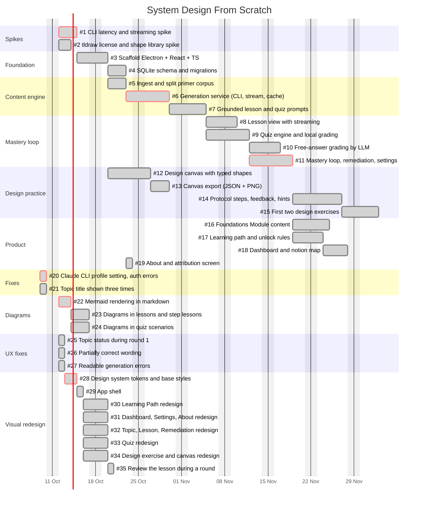

# Roadmap

Gantt chart of the GitHub issues of `jbclaramonte/system-design-from-scratch`. Dependencies in the chart mirror the "Depends on" section of each issue. Dates and durations are estimates (solo, part-time pace not accounted for).

Last updated: 2026-10-10.

## Dependency table

| Issue | Depends on |
|---|---|
| #1 | none |
| #2 | none |
| #3 | #1 |
| #4 | #3 |
| #5 | #3 |
| #6 | #4, #1 |
| #7 | #5, #6 |
| #8 | #7 |
| #9 | #7 |
| #10 | #9 |
| #11 | #8, #9 |
| #12 | #2, #3 |
| #13 | #12 |
| #14 | #13, #11 |
| #15 | #14 |
| #16 | #11 |
| #17 | #11 |
| #18 | #17 |
| #19 | #5 |
| #20 | none |
| #21 | none |
| #22 | none |
| #23 | #22 |
| #24 | #22 |
| #25 | none |
| #26 | none |
| #27 | none |
| #28 | none |
| #29 | #28 |
| #30 | #29 |
| #31 | #29 |
| #32 | #29 |
| #33 | #29 |
| #34 | #29 |
| #35 | #32 |

## Conventions

- One bar per GitHub issue; label format `#<number> Title`.
- Status tags: `done`, `active`, `crit` (critical path).
- Update this chart and the table whenever an issue is created, started, closed, re-scoped, rescheduled, or its dependencies change.
