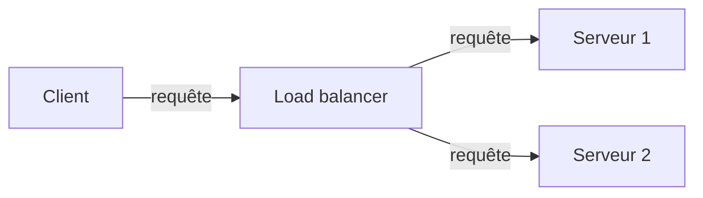
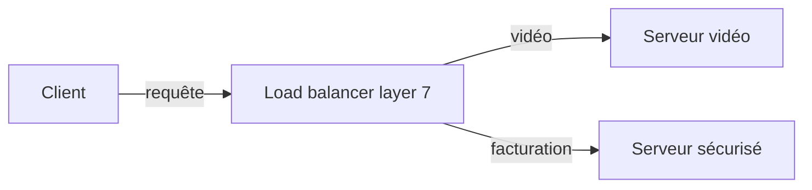
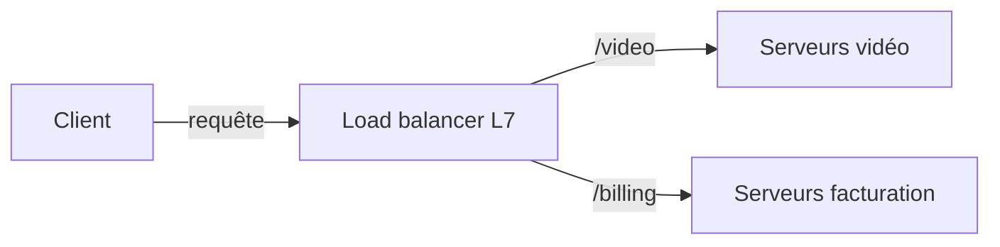
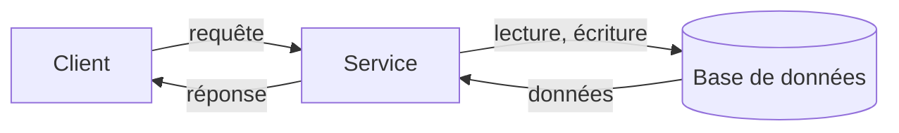
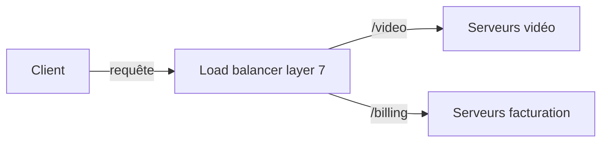
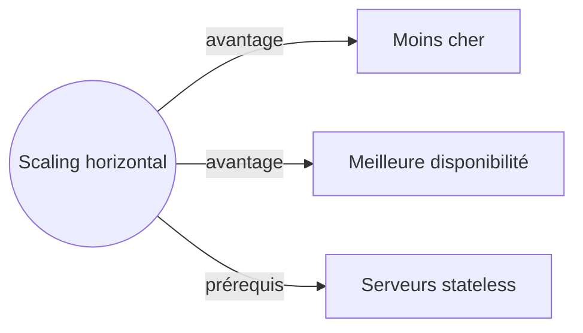

# Sample diagrams in generated lessons

Raw output of `scripts/diagram-quality-check.ts` (real CLI, default model and effort of the app). The review is in [[Prompts#Diagram quality review (2026-10-09)]]. Each diagram is checked with `checkDiagramSource` (the pipeline's validator at the time of the run) and with mermaid's own parser in Node (parse only, no layout). The pipeline now runs both through `parseDiagramSource` (2026-10-10); a re-run of the script reports that validator instead. Primer excerpts: Content from "The System Design Primer" by Donne Martin and contributors (https://github.com/donnemartin/system-design-primer), commit ae9bbd7b02d90b9866215de185217d33f39ab733, licensed under CC BY 4.0 (https://creativecommons.org/licenses/by/4.0/).

CLI calls: 3. call 1 (text): 15.1 s, 2316 output tokens; call 2 (text): 8.9 s, 980 output tokens; call 3 (text): 6.5 s, 683 output tokens.

## Lesson: Load balancer

> [!info] Automatic checks
> - Diagrams: 2; invalid before repair: 0; repaired: false; failures recorded: []
> - Citations unknown: []; words: 868
> - Diagram 1: checkDiagramSource ok (flowchart), mermaid.parse ok, nodes 4
> - Diagram 2: checkDiagramSource ok (flowchart), mermaid.parse ok, nodes 4

### Le load balancer

Imagine un supermarché avec une seule caisse ouverte : la file s'allonge et tout le monde attend. Si le magasin ouvre dix caisses, il faut quelqu'un à l'entrée qui dise à chaque client quelle caisse prendre, sans l'envoyer vers une caisse fermée. Ce rôle existe en informatique : c'est le **load balancer** (répartiteur de charge). Il résout le problème d'un site qui reçoit trop de requêtes pour un seul serveur, ou dont le serveur tombe en panne.

#### Le rôle du load balancer

<!-- notion: load-balancer-role -->

Un **load balancer** reçoit les requêtes des clients et les distribue à plusieurs ressources de calcul, comme des serveurs d'application ou des bases de données. Ensuite, il renvoie la réponse de la ressource au bon client. [source: load-balancer]

Comment ça se passe, étape par étape :

1. Le client envoie sa requête au load balancer.
2. Le load balancer choisit un serveur.
3. Le serveur traite la requête.
4. Le load balancer renvoie la réponse au client.

Regarde le schéma : le client ne parle qu'au load balancer, qui répartit le travail entre deux serveurs.

Le load balancer est efficace pour :

- éviter d'envoyer des requêtes vers des serveurs en panne (unhealthy) ;
- éviter de surcharger une ressource ;
- aider à supprimer un **single point of failure** (un élément dont la panne arrête tout le système). [source: load-balancer]

Pour choisir un serveur, il peut utiliser plusieurs critères : aléatoire, le moins chargé, session/cookies, round robin (chacun son tour) ou round robin pondéré, layer 4, layer 7. [source: load-balancer]

Il peut être matériel (cher) ou logiciel, comme HAProxy. [source: load-balancer]

**Inconvénients :**

- Il peut devenir un goulot d'étranglement (**bottleneck**) s'il manque de ressources ou s'il est mal configuré.
- Un seul load balancer est lui-même un single point of failure. On en configure donc plusieurs, en mode active-passive ou active-active, ce qui ajoute de la complexité. [source: load-balancer]

#### Layer 4 et layer 7

<!-- notion: layer-4-vs-layer-7 -->

Un load balancer peut décider de deux façons. Elles correspondent à deux couches du réseau : le **layer 4** (couche transport) et le **layer 7** (couche application).

**Layer 4**

- Il regarde les informations de transport : les adresses IP source et destination, et les ports, dans l'en-tête.
- Il ne lit pas le contenu du paquet.
- Il transmet les paquets réseau vers le serveur et depuis lui, en faisant du NAT (Network Address Translation). [source: load-balancer/layer-4-load-balancing]

**Layer 7**

- Il regarde la couche application : le contenu de l'en-tête, du message et des cookies.
- Il termine le trafic réseau, lit le message, prend sa décision, puis ouvre une connexion vers le serveur choisi. [source: load-balancer/layer-7-load-balancing]

Exemple : un load balancer layer 7 envoie le trafic vidéo vers des serveurs qui hébergent les vidéos. Il envoie le trafic de facturation, plus sensible, vers des serveurs renforcés en sécurité. [source: load-balancer/layer-7-load-balancing]

Regarde le schéma : le choix dépend du contenu de la requête.

**Compromis :** le layer 4 demande moins de temps et de ressources que le layer 7, mais il est moins flexible. Sur du matériel standard moderne, la différence de performance peut être minime. [source: load-balancer/layer-7-load-balancing]

#### Le scaling horizontal

<!-- notion: horizontal-scaling -->

Le **scaling horizontal** (scaling out) consiste à ajouter des machines ordinaires (**commodity machines**) derrière le load balancer. Le load balancer améliore ainsi la performance et la disponibilité. [source: load-balancer/horizontal-scaling]

L'alternative est le **vertical scaling** : mettre un seul serveur sur un matériel plus cher et plus puissant. [source: load-balancer/horizontal-scaling]

Avantages du scaling horizontal :

- il coûte moins cher ;
- il donne une meilleure disponibilité ;
- il est plus facile de recruter des gens qui connaissent du matériel standard que des systèmes spécialisés. [source: load-balancer/horizontal-scaling]

Exemple : ta boutique en ligne reçoit plus de visiteurs. Au lieu d'acheter une machine énorme, tu ajoutes trois serveurs ordinaires derrière le load balancer.

**Inconvénients :**

- Cela ajoute de la complexité et demande de cloner les serveurs.
- Les serveurs doivent être **stateless** (sans état) : ils ne gardent aucune donnée liée à un utilisateur, comme les sessions ou les photos de profil.
- Les sessions peuvent être stockées dans un lieu centralisé : une base de données (SQL, NoSQL) ou un cache persistant (Redis, Memcached).
- Les serveurs en aval, comme les caches et les bases de données, doivent gérer plus de connexions simultanées quand les serveurs en amont se multiplient. [source: load-balancer/horizontal-scaling]

#### Récapitulatif

- **Le rôle du load balancer** : il répartit les requêtes des clients entre plusieurs serveurs et évite d'envoyer du trafic vers les serveurs en panne.
- **Layer 4 et layer 7** : le layer 4 décide avec les informations de transport, plus vite mais avec moins de flexibilité, et le layer 7 décide avec le contenu de la requête.
- **Le scaling horizontal** : on ajoute des machines ordinaires derrière le load balancer, ce qui coûte moins cher mais demande des serveurs stateless et plus de capacité en aval.

## Remediation Lesson: layer-4-vs-layer-7 (concrete_example)

> [!info] Automatic checks
> - Diagrams: 1; invalid before repair: 0; repaired: false; failures recorded: []
> - Citations unknown: []; words: 375
> - Diagram 1: checkDiagramSource ok (flowchart), mermaid.parse ok, nodes 4

#### Layer 4 et layer 7

Imagine un site de streaming. Il a deux groupes de serveurs : trois serveurs « vidéo » qui stockent les films, et deux serveurs « facturation » plus protégés, qui gèrent les paiements. Un load balancer (répartiteur de charge) se place devant.

Trois requêtes arrivent :
1. `GET /video/film42`
2. `GET /video/film7`
3. `POST /billing/pay`

**Premier cas : le load balancer ne regarde que le « colis ».** Il lit seulement l'adresse IP source, l'adresse de destination et le port. Il ne regarde pas ce qu'il y a dedans. Pour lui, les trois requêtes se ressemblent : même destination, même port. Il peut donc envoyer le paiement vers un serveur vidéo. Il ne sait pas faire la différence. C'est du **layer 4** : il décide avec les informations de transport, sans lire le contenu du paquet. [source: load-balancer/layer-4-load-balancing]

**Deuxième cas : le load balancer ouvre l'enveloppe.** Il reçoit la requête, lit le message (l'adresse `/video` ou `/billing`, les en-têtes, les cookies), choisit un serveur, puis ouvre une connexion vers lui. Les deux requêtes `/video` vont vers les serveurs vidéo. Le paiement va vers les serveurs de facturation sécurisés. C'est du **layer 7** : il décide selon le contenu de la requête. [source: load-balancer/layer-7-load-balancing]

Regarde le schéma : le choix du groupe dépend du chemin lu dans la requête. Seul un load balancer qui lit le message peut faire ça.

Alors pourquoi ne pas toujours utiliser le layer 7 ? Parce que le layer 4 demande moins de temps et moins de ressources de calcul. Il est moins flexible, mais l'écart peut être minime sur un matériel moderne. [source: load-balancer/layer-7-load-balancing]

Retiens la règle : si ta décision dépend de l'URL, comme `/video`, il faut lire le contenu. Il te faut donc du layer 7.

**À retenir**
- Layer 4 : on répartit avec les IP et les ports, sans lire le contenu du paquet.
- Layer 7 : on répartit en lisant le contenu (en-têtes, message, cookies), par exemple pour envoyer `/video` vers des serveurs dédiés.
- Le layer 4 coûte moins cher en temps et en calcul, mais il est moins flexible.

## Protocol Step Lesson: high_level_design

> [!info] Automatic checks
> - Diagrams: 1; invalid before repair: 0; repaired: false; failures recorded: []
> - Citations unknown: []; words: 245
> - Diagram 1: checkDiagramSource ok (flowchart), mermaid.parse ok, nodes 3

#### Conception de haut niveau

Cette étape consiste à esquisser tous les composants importants du système et leurs connexions, puis à justifier tes idées [source: how-to-approach-a-system-design-interview-question/step-2-create-a-high-level-design]. Elle vient avant la conception détaillée de chaque composant, où l'on entre dans le détail [source: how-to-approach-a-system-design-interview-question/step-3-design-core-components].

Exemple : pour un service de raccourcissement d'URL, on dessine d'abord les grandes briques, sans entrer dans le détail.

##### Pourquoi c'est important

- Sans vue d'ensemble, tu plonges trop tôt dans les détails (comme le hash d'une URL) sans savoir où ils s'insèrent.
- Un composant non justifié reste inexpliqué : tu ne peux pas défendre ton choix plus tard.
- Une flèche manquante rend un cas d'usage impossible à suivre de bout en bout.

##### Ce que tu vas produire

- Un schéma où chaque cas d'usage se suit du client jusqu'au stockage, puis retour.
- Les composants principaux (clients, serveurs, stockage), et rien d'inexpliqué.
- Des flèches qui correspondent au trajet des requêtes, sans lien oublié ni flèche dans le vide.
- Une justification des choix principaux, en étiquettes, en notes ou dans le champ de notes.

##### Piège fréquent

Empiler des composants « parce qu'on les voit partout » sans pouvoir dire à quoi chacun sert dans ton design.

**À retenir** : un schéma simple, cohérent et justifié vaut mieux qu'un schéma chargé que tu ne peux pas expliquer.

## Repair: crafted lesson with two broken blocks

> [!info] Automatic checks
> - Diagrams: 2; invalid before repair: 2 (#1 forbidden_content, #2 unsupported_type); repaired: true; failures recorded: []
> - Citations unknown: []; words: 64
> - Diagram 1: checkDiagramSource ok (flowchart), mermaid.parse ok, nodes 4
> - Diagram 2: checkDiagramSource ok (flowchart), mermaid.parse ok, nodes 4

#### Layer 7

Le load balancer layer 7 lit le contenu de la requête pour choisir le serveur.

Le scaling horizontal ajoute des machines ordinaires derrière le load balancer.

Repair run: call 1 (diagram repair): 3.3 s, 253 output tokens.
