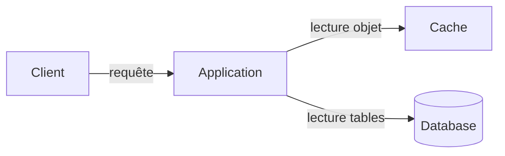
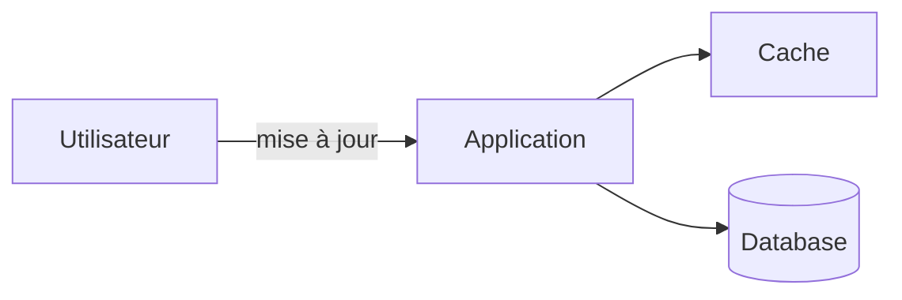

# Sample quiz with Diagrams

Raw output of `scripts/quiz-diagrams-check.ts` (real CLI, `--model sonnet --effort low`): one quiz on the cache topic, from the Notion Outline and the lesson of [[samples/cache|the cache sample]]. See [[Quiz Engine#Quiz Diagrams quality review]] for the review. Primer excerpts: Content from "The System Design Primer" by Donne Martin and contributors (https://github.com/donnemartin/system-design-primer), commit ae9bbd7b02d90b9866215de185217d33f39ab733, licensed under CC BY 4.0 (https://creativecommons.org/licenses/by/4.0/).

> [!info] Automatic checks
> - Quiz types: single_choice, single_choice, single_choice, multiple_choice, scenario, single_choice, scenario, free_answer
> - Questions with a diagram: 2/8 (scenario, scenario)
> - CLI calls: 1 (more than 1 means the first output was refused)
> - call 1: 2587 output tokens after 17.0 s (first event 1172 ms, first JSON 2190 ms, first text - ms, timeout 120000 ms); raw: messages 1, blocks [tool_use:StructuredOutput], stop reasons [tool_use], num_turns 2, duration 15833 ms (api 15806 ms), usage {"input_tokens":2,"cache_creation_input_tokens":10359,"cache_read_input_tokens":2909,"output_tokens":2587,"output_tokens_details":{"thinking_tokens":0},"server_tool_use":{"web_search_requests":0,"web_fetch_requests":0},"service_tier":"standard","cache_creation":{"ephemeral_1h_input_tokens":10359,"ephemeral_5m_input_tokens":0},"inference_geo":"global","iterations":[{"input_tokens":2,"output_tokens":2587,"cache_read_input_tokens":2909,"cache_creation_input_tokens":10359,"cache_creation":{"ephemeral_5m_input_tokens":0,"ephemeral_1h_input_tokens":10359},"type":"message"}],"speed":"standard","fallback_credit":null}, is_error false

## Quiz

### Q1. single_choice (cache-basics)

Une boutique en ligne met un produit en vedette et tout le monde le demande en même temps. Que fait un cache placé devant la database ?

- [x] Il répond à la place de la database et absorbe le pic de trafic.
- [ ] Il remplace la database comme source of truth.
- [ ] Il supprime le besoin de cache invalidation.
- [ ] Il répartit les écritures entre les partitions de la database.

Explanation: Le cache sert les demandes populaires sans solliciter la database, ce qui absorbe les pics. Il ne remplace pas la source of truth et il ajoute même le besoin d'invalidation.

Sources: cache

### Q2. single_choice (cache-layers)

Une page est vue deux fois de suite par le même utilisateur. Quel cache peut servir la seconde fois sans même envoyer de requête au serveur ?

- [x] Le cache du navigateur, côté client
- [ ] Le cache interne de la database
- [ ] Le cache du reverse proxy
- [ ] Le cache de l'application server

Explanation: Le navigateur garde ce qu'il a déjà reçu. Le reverse proxy évite de solliciter l'application server, mais la requête part quand même du client.

Sources: cache/client-caching

### Q3. single_choice (in-memory-cache)

Pourquoi un in-memory cache comme Redis est-il plus rapide qu'une database classique ?

- [ ] Il utilise LRU pour écrire plus vite sur le disque.
- [x] Ses données sont en RAM, alors que la database écrit sur disque.
- [ ] Il stocke ses données dans des fichiers plus compacts.
- [ ] Il évite d'utiliser des clés grâce à un key-value store.

Explanation: La RAM est bien plus rapide que le disque. LRU sert à choisir quoi retirer quand la RAM est pleine, pas à accélérer l'écriture.

Sources: cache/application-caching

### Q4. multiple_choice (query-level-caching)

Tu mets en cache le résultat de queries avec le hash de la query comme clé. Quelles difficultés cela provoque-t-il ?

- [x] Supprimer un résultat en cache est difficile quand la query est complexe.
- [x] Si une cellule change, il faut retirer toutes les queries en cache qui pourraient la contenir.
- [ ] Deux fois la même query donne deux hash différents.
- [ ] Le résultat ne peut jamais être relu depuis le cache.

Explanation: Le problème vient de l'invalidation : retrouver toutes les clés concernées est pénible. La même query a toujours le même hash, et le cache sert bien à relire le résultat.

Sources: cache/caching-at-the-database-query-level

### Q5. scenario (object-level-caching)

*Sur ton site, un client modifie son adresse. Ton application assemble un objet « profil client » à partir de plusieurs tables et le garde en cache. Tu veux que le prochain accès montre la nouvelle adresse.*

Que fais-tu avec l'objet en cache ?

> [!info] Diagram checks
> - Source checks: ok (flowchart)
> - Nodes: 4
> - Answer leak: none found

- [ ] Tu le gardes tel quel jusqu'à ce que LRU le retire.
- [x] Tu le retires du cache pour qu'il soit reconstruit au prochain accès.
- [ ] Tu vides tout le cache de l'application.
- [ ] Tu changes la clé de chaque autre objet du cache.

Explanation: Quand les données sous-jacentes changent, on retire l'objet concerné. Attendre LRU laisserait une adresse périmée.

Sources: cache/caching-at-the-object-level

### Q6. single_choice (cache-aside)

Avec cache-aside, que fait l'application après un cache miss ?

- [ ] Elle renvoie une erreur et attend que le cache se remplisse.
- [ ] Elle demande au cache d'aller lire la database lui-même.
- [x] Elle charge l'entrée depuis la database, l'ajoute au cache, puis la renvoie.
- [ ] Elle écrit l'entrée dans la database de façon asynchrone.

Explanation: Dans cache-aside, c'est l'application qui lit la database et remplit le cache ; le cache n'interagit pas avec le stockage.

Sources: cache/when-to-update-the-cache

### Q7. scenario (write-through-and-write-behind)

*Tu gères un service où chaque écriture doit pouvoir être relue tout de suite avec une donnée fraîche. Perdre une écriture est inacceptable, et les utilisateurs tolèrent une mise à jour un peu lente.*

Quelle stratégie d'écriture choisis-tu ?

> [!info] Diagram checks
> - Source checks: ok (flowchart)
> - Nodes: 4
> - Answer leak: none found

- [ ] Write-behind, car l'écriture asynchrone est plus rapide.
- [x] Write-through, car l'écriture synchrone garde des données fraîches sans risque de perte.
- [ ] Refresh-ahead, car il remplace toute écriture.
- [ ] Aucun cache, car un cache ne peut pas être frais.

Explanation: Write-through écrit de façon synchrone : plus lent mais données non stale. Write-behind risque de perdre des données si le cache tombe.

Sources: cache/when-to-update-the-cache

### Q8. free_answer (refresh-ahead-and-invalidation)

Explique ce qu'est le refresh-ahead, quel est son avantage et quel risque il comporte.

Expected points:
- Le cache rafraîchit une entrée récemment consultée avant son expiration
- Avantage : latency réduite si la prédiction est bonne
- Risque : une mauvaise prédiction peut donner une performance pire

Model answer: Avec refresh-ahead, le cache rafraîchit tout seul les entrées récemment consultées avant qu'elles expirent, ce qui peut baisser la latency. Mais s'il prédit mal ce qui sera utile, la performance peut être pire que sans refresh-ahead.

## Review (2026-10-10, 7 real calls in total)

| Run | Prompt | Calls | Time | Refusal | Diagrams |
|---|---|---|---|---|---|
| 1 | `quiz-5` draft (soft wording) | 2 | 17.8 s + 15.0 s | unlogged | 0/8 |
| 2 | `quiz-5` firmer | 1 | timed out (script override of 300 s) | - | - |
| 3 | `quiz-5` firmer | 2 | 17.2 s + 16.6 s | "Cover at least 8 of the target notions; not covered: object-level-caching" | 2/8 (both scenarios) |
| 4 | `quiz-6` (notion coverage stated) | 1 | 18.6 s | none | 4/8 (3 scenarios, 1 single choice) |
| 5 | `quiz-7` (no flow of a choice) | 1 | 17.0 s | none | 2/8 (both scenarios), this note |

**Root causes.**
- *0 Diagrams*: the first wording was optional and invited omission ("omit the field rather than writing a weak diagram"). Stating that every scenario with components or a request flow gets one fixed it in runs 3 to 5.
- *Refusal and doubled time*: the schema requires every target notion when the quiz has room for them (8 notions, 8 questions). The prompt only said "cover as many notions as possible", so the model dropped one and the automatic retry doubled the wall time (about 34 s). This rule predates #24, and no Diagram check refused anything. `quiz-6` states the rule ("Tag every notion listed... this is checked"), and runs 4 and 5 passed first time.
- *300 s timeout*: not reproduced. Every logged call was one message with a single `StructuredOutput` tool use, no thinking, `stop_reason` tool_use, about 2.6k output tokens, first JSON fragment after about 2 s, and 15.6 to 17.4 s of API time. The prompt (26k characters, the lesson is 12k) and the JSON schema (4.6k characters, 8 enums) are not the bottleneck. The 300 s was the script's own override; the app uses `DEFAULT_TIMEOUT_MS` (120 s), and a hung call fails with the typed `timeout` error.

**Quality.**
- Every Diagram passed the source checks (3 to 4 nodes, flowchart) and the automatic leak check. All were answerable from the lesson: only application, cache, database and client.
- In `quiz-6`, the write-strategy question drew Application -> Cache -> Database writes, which *is* write-through, the correct answer: a structural leak that the text check cannot catch. `quiz-7` forbids drawing a choice's flow, and in this run the same question got a neutral drawing (Application to Cache and to Database). That is one sample, not proof.
- Usefulness is modest. Most Diagrams restate the scenario's three or four components; none shows something the text does not.
- Drawn in the built app's quiz player (the three `quiz-6` scenario Diagrams, scratch profile): readable, `role="img"` named after the prompt, still drawn after answering, no console warning. The `quiz-7` Diagrams were not drawn in the app (same shapes).
